# EfficientFormer论文阅读笔记（主要进行翻译和自己的理解）

### Abstract

​	在计算机视觉任务中，VIT已经展现出了非常快的进步，并在各种测试中取得了有希望的结果。然而，由于巨大的参数量以及使用注意力机制的模型设计特点，基于VIT的模型通常比轻量级的卷积神经网络慢几倍。因此，将VIT部署到实时的应用中特别有挑战性，尤其是像部署在手机这样的资源受限的设备上。最近的一些研究努力通过改变VIT的网络架构或者在VIT中混合MobileNet模块去减少VIT的计算量，但是预测的速度仍然不稳定。这引出了一个重要的问题：Transformer能否在获得高性能的同时，运行速度达到MobileNet的速度？为了回答这个问题，我们首先重新审视了ViT-based模型中使用的网络架构和运算操作，并识别出了效率低下的设计。然后，我们引入了一个尺寸一致的纯Transformer（不包含MobileNet块）作为一个设计范式。最后，我们进行了延迟驱动的剪裁，得到了被称为EfficientFormer的最终模型。大量的实验表明了EfficientFormer在移动设备上性能和速度方面的优越性。我们最快的模型，EfficientFormer-L1，在ImageNet-1k的数据集上达到了第一的准确率，79.2%，并且在iPhone12上进行预测只有1.6ms的延迟，这和MobileNetv2x1.4一样的快；我们最大的模型EfficientFormer-L7，有83.3%的准确率并且只需要7ms的延迟。我们的工作证明，设计得当的Transformer可以在保持高性能的同时，在移动设备上达到极低的延迟。

### 1.Introduction

​		Transformer这个架构，一开始是为NLP任务设计的，该架构引入了一种多头自注意力机制，改机制允许网络模型建立长期依赖性，且易于并行化。在这个背景下，Dosovitskiy等人将注意力机制引入了2D图像中并且提出了VIT模型，这种模型将输入图像划分为不重叠的块，通过多头自注意力机制来学习块之间的表示，而不需要归纳偏置。与CNN相比，VIT展示了有希望的结果。在VIT成功之后，有几项工作探讨了ViT的潜力，包括改进训练策略，引入架构变化，重新设计注意力机制，并且提升在各种视觉任务的性能，如分类任务，分割任务和检测任务。

​		在不好的一方面，Transformer经常慢于CNN数倍。有很多因素限制了VIT的预测速度，这包括大量的参数，随着token长度增加而平方级增长的计算复杂度，无法折叠的归一化层，以及缺乏编译器级别的优化，使得Transformer的延迟非常高。这种高延迟使得Transformer在资源受限的硬件上进行实际应用变得不切实际，例如在移动设备和可穿戴设备上的增强现实或虚拟现实应用。因此，轻量级CNN仍然是实时推理的默认选择。

​		为了缓解Transformer的延迟瓶颈，已经提出了许多方法。例如，一些工作考虑通过将线性层变为卷积层，将自注意力机制与MobileNet模块结合，或引入稀疏注意力来设计新的架构或操作，以减少计算成本，而其他工作则利用网络搜索算法或剪枝来提高效率。尽管现有的工作已经改进了计算与性能的权衡，但是关于Transformer模型的适用性的根本问题仍未得到回答：能否让强大的视觉Transformer以MobileNet的速度运行，并成为边缘应用的默认选项？我们的工作通过以下贡献对这个问题进行了研究：

• 首先，我们通过延迟分析重新审视了ViT及其变体的设计原则（第3节）。我们遵循现有的工作，使用iPhone 12作为测试平台，并使用公开可用的CoreML作为编译器，因为移动设备被广泛使用，且结果可以容易地复现。

• 其次，基于我们的分析，我们确定了ViT中的低效设计和运算符，并提出了一种新的、尺寸一致的设计范式，用于视觉Transformer（第4.1节）。

• 第三，从一个采用新设计范式的超网络开始，我们提出了一个简单而有效的延迟驱动剪枝方法，以得到一系列新的模型，即EfficientFormers（第4.2节）。我们直接优化推理速度，而不是MACs或参数数量。

### 3.On-Device Latency Analysis of Vision Transformers

​		大多数现有的方法都是通过优化转换器的计算复杂度或者从服务器GPU获取的吞吐量来提高推理速度。然而，这些度量并不能真实反映设备上的实际延迟。为了清楚地理解哪些操作和设计选择会减慢边缘设备上ViTs的推理速度，我们对一系列模型和操作进行了全面的延迟分析，如图2所示，从中我们得出了以下观察结果。

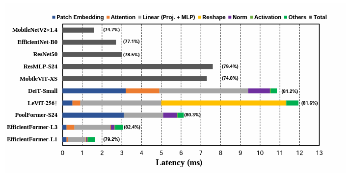

**从图里观测出的第一个结论**：在移动设备上，在进行Patch embedding使用大的卷积核和大步长是导致速度上的瓶颈的一个因素。（图里的蓝色部分）

​		Patch Embedding通常使用大内核和大步长的非重叠卷积层来实现。一种常见的观点是Transformer网络中的patch Embedding层的计算量是微不足道可以忽略的。然而，在图中我们可以看到，通过对比使用了大卷积核大步长的patch Embedding层的模型如DelT，PoolFormer和没有使用这种结构的LeVIT和EfficientFormer，表明了Patch Embedding实际是一个在移动设备上限制速度的瓶颈。

​		大核卷积通常不被大多数编译器很好地支持，并且不能通过现有的像Winograd这样的算法来加速。另一种选择是，可以通过由一系列硬件高效的3 × 3卷积构成的快速下采样的 convolution stem来替换非重叠的patch嵌入。

**convolution stem**："Convolution stem"是卷积神经网络中的一个术语，通常指的是网络开始部分的一系列卷积层。

**我的理解**：3x3的卷积可以更好的利用现代硬件进行优化，可以有更快的速度，并且使用一系列3x3的卷积可以和patch Embedding达到同样的效果。**例如**：

假设我们有一个输入图像的大小为 224×224，我们想要把它转化为 56×56 的patch embeddings。

1. **使用patch embedding**：我们可以选择一个 4×4的patch size，stride设置为4（无重叠）。这样，原始的 224×224 图像将被划分为 56×56 个 4×4 的patches。然后，每个patch被视为一个向量，并用于后续的transformer模型。
2. **使用一系列的3x3卷积**：我们可以使用一系列的3x3卷积层来代替patch embedding。假设我们使用三个3x3的卷积层，stride都设置为2。第一层卷积将会把 224×224的图像变为 112×112，第二层卷积将会把 112×112 的图像变为 56×56，第三层卷积将会把 56×56 的图像变为 28×28。（也就是三次下采样，也指稳重的一系列3x3卷积）这样，我们也得到了 56×56 个patches，和前面的patch embedding方法达到了相同的效果。

**从图里观测出的第二个结论**：对于token mixer的选择，保持一致的特征维度是重要的。多头自注意力并不一定是速度瓶颈。

​		近期的工作将基于ViT的模型扩展到由MLP块和未指定的token mixer组成的MetaFormer架构。选择token mixer是构建基于ViT的模型时的一个关键设计选择。选择有很多种——传统的具有全局感受野的MHSA mixer，更复杂的移位窗口注意力，或者像池化这样的非参数运算符。

​		我们将比较范围缩小到两种token mixer，即池化和MHSA，我们选择前者是因为其简单和高效，而后者则是因为其表现更好。像移位窗口这样更复杂的token mixer目前并未被大多数公开的移动编译器所支持，所以我们并未将它们纳入考虑范围。此外，我们并没有使用深度卷积来替代池化，因为我们的重点是在不依赖轻量级卷积的帮助下构建架构。

​		为了更好的理解这两种token mixers，我们展示了如下的两组比较。

​		第一，通过比较PoolFormer-s24和LeViT-256 ，我们观察到Reshape操作是LeViT-256的速度的瓶颈。LeViT-256的大部分操作都是在4D张量上实现的CONV，当将特征传递到MHSA时需要频繁的重塑操作，因为注意力必须在patchified的3D张量上执行（丢弃额外的注意力头维度）。Reshape的广泛使用限制了LeViT在移动设备上的速度（见图2）。另一方面，当网络主要由基于CONV的实现组成时，例如使用CONV 1×1作为MLP实现和CONV stem进行下采样，池化自然适应4D张量。因此，PoolFormer表现出更快的推理速度。

**PoolFormer**：简单学习了一下，PoolFormer源于MetaFormer的架构，PoolFormer是这种架构的一种实现形式。MetaFormer这种架构提出了一种观点，像Transformer这种架构之所以取得成功是因为他们使用了MetaFormer这种架构，这种架构是一种token mixer+channel MLP的结构，即先混合token间的信息，再混合channel间的信息，Transformer就是使用了MHSA这种结构作为了token mixer。而PoolFormer就是用了池化层作为它的token mixer。**而池化这个操作直接适用于4D张量操作，不需要频繁的重塑，所以它更快。**

​		

​		第二，通过比较DeiT-Small和LeViT-256，我们发现如果特征维度一致并且不需要Reshape操作，MHSA在移动设备上并不会带来显著的开销。尽管计算量更大，但具有一致3D特征的DeiT-Small可以达到与新的ViT变体（即LeViT-256）相当的速度。

​		在这项工作中，我们提出了一个维度一致的网络，它既有4D的特征实现，也有3D的MHSA，但是我们消除了低效的频繁的Reshape操作

**从图里观测出的第三个结论**：相比于在Layer Normalization (LN) 层或者 Group Normalization (GN)层后边接线性层，卷积层（CONV）后边接批量归一化层（BN)的延迟更小，执行更快 。并且这样的设计在精度上的损失是可以接受的。

​		选择MLP的实现方式也是一个重要的设计选择。通常会选择以下两种选项之一：使用层归一化（LN）和3D线性投影（proj.），或者使用1x1的卷积（CONV）和批量归一化（BN）。CONV-BN更有利于降低延迟，因为BN可以被折叠到前面的卷积中以提高推理速度，而动态归一化（如LN和GN）在推理阶段仍然需要收集运行统计信息，因此会增加延迟。从图2中的DeiT-Small和PoolFormer-S24的分析，以及之前的工作可以看出，LN引入的延迟约占整个网络延迟的10%−20%。

​		根据我们在附录表3中的消融实验研究，相比于GN，CONV-BN只会轻微地降低性能，且与通道级LN的结果相当。在这项工作中，我们尽可能地应用CONV-BN（在所有潜在的4D特征中）以获得延迟的优势，同时对性能的影响可以忽略不计。而对于3D特征，我们使用LN，这与ViT中的原始MHSA设计保持一致，并能得到更好的准确性。

**三种归一化层的区别：**

1. 批量归一化（Batch Normalization, BN）：它是对每一个特征维度进行归一化，但归一化的统计量（均值和方差）是在一个 mini-batch 的数据上计算得到的。因此，BN 对 mini-batch 的大小比较敏感，如果 batch size 太小，可能会导致计算的统计量不准确，从而影响模型的训练效果。
2. 层归一化（Layer Normalization, LN）：它是在单个样本上，对所有特征维度进行归一化，计算的统计量（均值和方差）是在所有特征维度上计算得到的。因此，LN 不受 batch size 的影响，更适合于 batch size 较小或者变化较大的场景，如自然语言处理中的序列模型。
3. 组归一化（Group Normalization, GN）：它是介于 BN 和 LN 之间的一种归一化方法，它将特征维度分成若干组，然后对每一组的特征进行归一化。GN 同样不受 batch size 影响，且在保持了 BN 的优点的同时，避免了其对 batch size 的依赖。

**4D和3D特征：**

- 4D特征通常指的是卷积神经网络中的特征图 (feature maps)，其维度通常为Batch Size X Channels X Height X Weight。其中，Batch Size是批次大小，Channels是特征图的通道数，Height和Width则分别是特征图的高和宽。

- 3D特征通常指的是在自注意力机制（如Transformer模型）中的序列特征，其维度通常为Batch Size X Sequence Length X Embedding Dimension。其中，Batch Size是批次大小，Sequence Length是序列长度，Embedding Dimension是嵌入向量的维度。

  

**我的理解**：这里主要比较了LN+linear层与Conv+BN层谁更适合4D模块中的MLP部分，实验证明Conv+BN可以减少延迟，并且精度减少不大，所以我们选择了Conv+BN的操作。而在3D模块当中的MLP,我们延续VIT的设计，使用LN。

**从图里观测出的第四个结论**：非线性函数（激活函数）的延迟取决于硬件和编译器。

​		最后研究了非线性激活函数，包括GeLU、ReLU和HardSwish。以前的研究表明，在硬件上GeLU效率不高，会降低推理速度。然而，我们发现在iPhone 12上，GeLU的支持很好，几乎不比ReLU慢。相反，我们的实验发现HardSwish的速度令人惊讶地慢，可能没有得到编译器的良好支持（使用HardSwish的LeViT-256推理延迟为445毫秒，而使用GeLU时为119毫秒）。我们得出的结论是，应根据手头的具体硬件和编译器情况，对非线性激活函数进行逐案确定。我们相信，大多数的激活函数在未来都将得到支持。在这项工作中，他们使用的是GeLU激活函数。

**我的理解**：在这个小节中，一共得出了四个结论，这四个结论也分别验证了VIT及其变体在哪些方面的设计导致延迟高以及他们的模型的各个部分为什么要进行这样的设计。

​		首先是Patch Embedding部分，以前使用大卷积核大步长的卷积进行，这样的参数多，计算量大，无法使用硬件加速，而如果使用一系列3x3的卷积进行下采样，不仅可以达到同样效果，并且可以大大的增加速度。

​		其次是选择什么样子的token mixer，其实在图上的结构中我们可以看到他提到的pooling层和MHSA都有使用，只不过是一个使用在4D上，一个使用在3D上，因为Pooling对于4D可以更好的计算。这里的思想主要源于MetaFormer这种架构，让MHSA不再独占宝座，可以让其他结构也充当它的作用。但是这里有一点不是很明白，既然说Pooling层和MHSA作用差不多，为啥不一直用4D，反而后边又要转换成3D使用MHSA。不过可以肯定的是，针对4D部分，使用Pooling层是一个非常好的选择。

​		再次是选择什么样的MLP，MetaFormer架构中针对MLP也可以进行变化，只要MLP能对通道信息进行混合就行，作者通过实验发现了针对4D最好的MLP是Conv+BN的组合，针对3D的还是使用VIT里边在MHSA后边接的LN。

​		最后作者讨论了激活函数导致的延迟，作者的实验表明GeLU激活函数是最好的，但作者任务在未来所有的激活函数都可以适用。这里的延迟主要与硬件有关，而与选择什么样的激活函数无关。

### **4.Design of EfficientFormer**

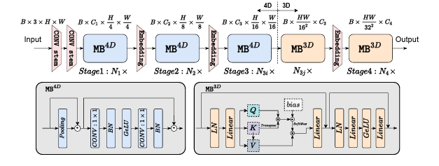

​		基于之前的延迟分析，我们提出了EfficientFormer的设计，如上图所示。该网络由一个patch嵌入（PatchEmbed）和一堆元转换器块（MB）组成，定义如下：

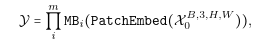

​		其中，X0 是具有批次大小为 B 和空间大小为[H,W]的输入图像，Y 是期望的输出，m是块的总数（深度）。MB 由TokenMixe后接一个 MLP 块组成，可以表示如下：

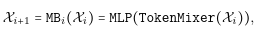

​		其中，Xi是进入第 i 个 MB 的中间特征。我们进一步定义阶段（S）为处理具有相同空间大小的特征的几个 MetaBlock 的堆栈，例如上图中的 N*1×5 表示 S*1 有 N*1 个 MetaBlocks。网络包括 4 个阶段。在每个阶段中，都有一个嵌入操作来投影嵌入维度并下采样标记长度，如上图中的嵌入所示。有了上述架构，EfficientFormer 是一个完全基于 transformer 的模型，而不需要集成 MobileNet 结构。接下来，我们将详细讨论网络设计的细节，特别是架构细节和搜索算法。

#### 4.1. Dimension-Consistent Design

​		根据第三节的观察，作者提出了一种"维度一致"的设计方案，它将网络划分为两个部分：一部分是4D部分，其中的操按照卷积网络的方式进行实现（MB4D）；另一部分是3D部分，其中的线性投影和注意力机制在3D张量上执行，以享受MHSA的全局建模能力，同时不牺牲效率（MB3D），如上图所示。

​		具体来说，网络开始于4D部分，而3D部分则应用在最后的阶段。注意，上图只是一个实例，4D和3D部分的实际长度在后面的架构搜索中会被具体指定。

​		首先，输入图像通过具有两个步长为2的3x3卷积核的CONV stem进行处理，这一步骤相当于patch embedding。

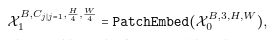

​		这里边Cj代表第j个阶段的channel数。

​		然后，网络开始使用带有简单池化层的token mixer的MB4D（MetaBlock 4D）来提取低级特征。

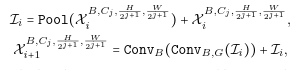

​		这里边ConvBG代表卷积层后面是否跟着BN层和激活函数层（GeLU）。值得注意的是，我们在池化混合器前并没有使用GN或LN，这是因为4D是基于CONV-BN设计的，因此每个池化混合器前都存在BN。

​		在处理完所有的 MB4D 块后，我们进行一次性的重塑操作，以改变特征的大小，并进入 3D 分区。MB3D 遵循常规的 ViT 结构，如图 3 所示。具体公式如下：

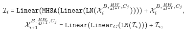

​		其中 "LinearG" 表示线性层后面跟着的 GeLU 激活函数。

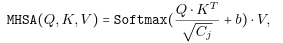

​		这里的 "QKV" 表示Query,Key和Value。而 "b" 是作为位置编码的参数化注意力偏置.

#### 4.2. Dimension-Consistent Design

**Design of Supernet**。基于尺寸一致的设计，我们构建了一个Supernet，用于搜索上图中显示的网络结构的有效模型（上图显示了搜索得到的最终网络的示例）。为了表示这样的Supernet，我们定义了MetaPath

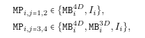

​		其中，I表示恒等路径，j表示第j阶段，i表示第i个块。Supernet可以通过用MP替换图3中的MB来表示。

如上述等式所示，在Supernet的S1和S2中，每个块可以选择来自MB4D或I，而在S3和S4中，块可以是MB3D，MB4D或I。我们只在最后两个阶段启用MB3D，原因有两个。首先，由于MHSA的计算与token长度的平方成正比，将其集成到早期阶段将大大增加计算成本。其次，将全局MHSA应用到最后的阶段与直觉相符，即网络的早期阶段捕获低级特征，而后期层学习长期依赖关系。

**Supernet**："Supernet"是网络架构搜索（Network Architecture Search，NAS）中的一个概念。在 NAS 的过程中，我们通常需要在许多不同的网络架构中进行搜索，以找到最佳的架构。这个搜索过程是非常耗时的，因为每次考虑一个新的网络架构时，我们都需要训练并评估这个新的网络。

"Supernet"是一种解决方案，它是一个大网络，包含了搜索空间中的所有可能的子网络。通过训练这个大网络，我们可以同时获得所有子网络的性能信息，这极大地加速了搜索过程。

**Searching Space**：我们的搜索空间包括每个阶段的 Cj（每个阶段的宽度），Nj（每个阶段中的块的数量，即深度），以及应用于 MB3D的最后N个块。

**Searching Algorithm**：这里创新了一种针对Supernet的搜索算法，由于我不太了解Supernet并且和最终结构为什么延迟小也无关，就跳过了。（以后要是自己弄新网络的话可能会用到，到时候再看）

### 5.Experiments and Discussion

我们通过 PyTorch 1.11和 Timm 库实现 EfficientFormer，这是最近的实践中的常见做法。我们的模型在装有 NVIDIA A100 和 V100 GPU 的集群上进行训练。iPhone 12 (A14 仿生芯片) 的推理速度是在 iOS 版本 15 上测量的，平均值取自 1000 次运行，使用所有可用的计算资源（NPU）或仅使用 CPU。使用 CoreMLTools 部署运行时模型。此外，我们在 Nvidia A100 GPU 上提供了延迟分析，批量大小为 64，以利用硬件 roofline。训练好的 PyTorch 模型以 ONNX 格式部署，并使用 TensorRT 编译。我们报告的 GPU 运行时间不包括预处理。我们在附录 6 中提供了详细的网络架构和更多的消融研究。

#### 5.1.Image Classification

​		所有的 EfficientFormer 模型都是在 ImageNet-1K 数据集上从头开始训练的，以进行图像分类任务。我们在训练和测试中都使用标准的图像大小（224 × 224）。我们遵循来自 DeiT的训练配方，但主要报告了 300 个训练周期的结果，以便与其他基于 ViT 的模型进行比较。我们使用 AdamW 优化器 ，进行 5 个周期的热身训练，并且使用余弦退火学习率调度。初始学习率设定为 10−3次方×批量大小/1024，最小学习率为 10−5次方。用于蒸馏的教师模型是在 ImageNet 上预训练的 RegNetY-16GF ，其 top-1 精度为 82.9%。结果在表 1 和图 1 中展示。

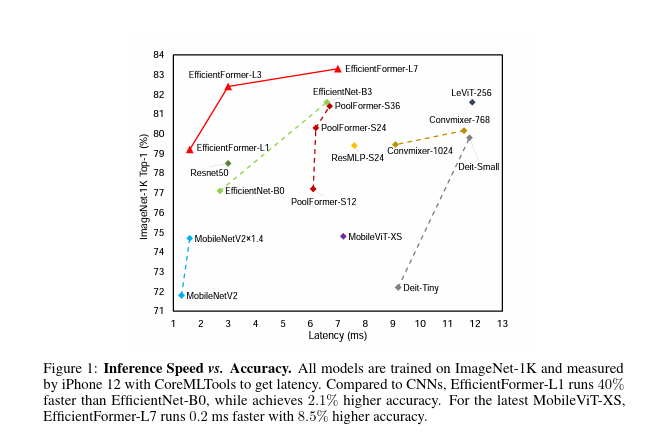

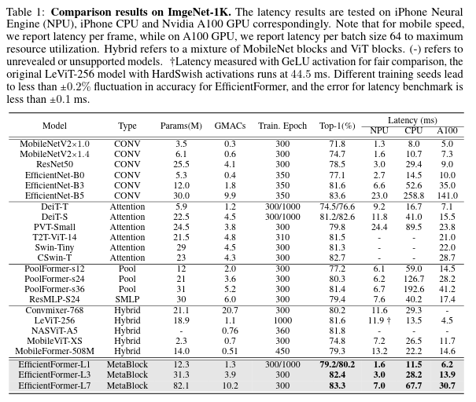

**Comparison to CNNs**:与广泛使用的基于 CNN 的模型相比，EfficientFormer 在准确性和延迟之间取得了更好的权衡。在 iPhone Neural Engine 上，EfficientFormer-L1 以 MobileNetV2 的 14 倍速度运行，同时实现了高 于其45% 的 top-1 准确率。此外，EfficientFormer-L3 以与 EfficientNet-B0 相似的速度运行，同时实现了相对其高出53%的top-1 准确率。对于性能较高的模型（>83% top-1），EfficientFormer-L7 的运行速度比 EfficientNet-B5 超过 3 倍，展示了我们模型优越的性能。此外，在桌面级 GPU（A100）上，EfficientFormer-L1 的运行速度比 EfficientNet-B0 快 38%，同时实现了高 于其2.1% 的 top-1 准确率。EfficientFormer-L7 的运行速度比 EfficientNet-B5 快 4.6 倍。这些结果使我们能够回答前面提出的核心问题：ViTs 不需要牺牲延迟来获得良好的性能，而且准确的 ViT 仍然可以像轻量级的 CNNs 那样具有超快的推理速度。

**Comparison to ViTs：**传统的 ViTs 在延迟方面仍然不如 CNNs。例如，DeiT-Tiny 的准确度与 EfficientNet-B0 相似，但其运行速度慢 3.4 倍。然而，EfficientFormer 在运行速度快很多的同时，表现得像其他 transformer 模型。EfficientFormer-L3 的准确度高于 DeiT-Small（82.4% vs. 81.2%），同时运行速度快其4 倍。值得注意的是，尽管最近的 transformer 变体 PoolFormer自然具有一致的 4D 架构，并且运行速度比典型的 ViTs 快，但全局 MHSA 的缺失大大限制了性能的上限。与 PoolFormer-S36 相比，EfficientFormer-L3 的 top-1 准确率高 1%，同时在 Nvidia A100 GPU 上运行速度快 3 倍，在 iPhone NPU 上运行速度快 2.2 倍，在 iPhone CPU 上运行速度快 6.8 倍。

**Comparison to Hybrid Designs：**现有的混合设计，如 LeViT-256 和 MobileViT，仍然在 ViTs 的延迟瓶颈上挣扎，并且很难超越轻量级的 CNNs。例如，LeViT-256 的运行速度比 DeiT-Small 慢，而且 top-1 准确率也低其1%。对于 MobileViT，一个包含 MHSA 和 MobileNet 块的混合模型，我们观察到它比 CNN 对应模型（例如，MobileNetV2 和 EfficientNet-B0）慢很多，而且准确度也不好（比 EfficientNet-B0 低 23%）。因此，简单地用 MobileNet 块来交换 MHSA 很难推动 Pareto 曲线向前，如图 1 所示。相比之下，EfficientFormer 作为纯粹的基于 transformer 的模型，可以在保持高性能的同时实现超快的推理速度。EfficientFormer-L1 的 top-1 准确率比 MobileViT-XS 高 4.4%，并且在不同的硬件和编译器上运行速度更快（在 Nvidia A100 GPU 计算上快 1.9 倍，在 iPhone CPU 上快 2.3 倍，在 iPhone NPU 上快 4.5 倍）。在相似的推理时间内，EfficientFormer-L7 的 ImageNet 上的 top-1 准确率比 MobileViT-XS 高 85%，证明了我们设计的优越性。

#### 5.2 EfficientFormer as Backbone

**Object Detection and Instance Segmentation：**我们遵循 Mask-RCNN 的实现，将 EfficientFormer 作为主干网络，并验证其性能。我们在 COCO 2017 数据集上进行实验，该数据集包含 118K 的训练集和 5K 的验证集。EfficientFormer 主干使用 ImageNet-1K 预训练权重进行初始化。与先前的工作类似，我们使用 AdamW 优化器，初始学习率为 2×10^-4，并训练12 个 epoch。我们将输入尺寸设置为 1333×800。

检测和实例分割的结果显示在表 2 中。EfficientFormers 做主干网络和 CNN结构的ResNet以及 transformer结构的PoolFormer做主干网络的表现一样优秀。在相似的计算成本下，EfficientFormer-L3 做主干网络的表现超过 ResNet50做主干网络的表现 3.4 个 box AP 和 3.7 个 mask AP，并且超过 PoolFormer-S24 做主干网络1.3 个 box AP 和 1.1 个 mask AP，证明 EfficientFormer 在视觉任务中作为强大的主干具有很好的泛化能力。

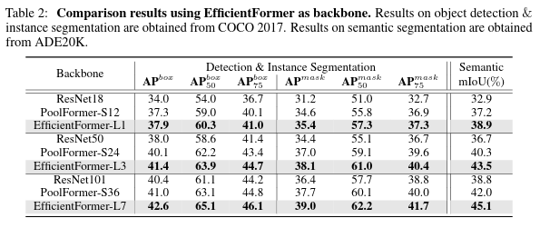

**Semantic Segmentation：**我们进一步验证了 EfficientFormer 在语义分割任务上的性能。我们使用了具有挑战性的场景解析数据集 ADE20K，该数据集包含 20K 的训练图像和 2K 的验证图像，覆盖 150 个类别。与现有的工作类似，我们将 EfficientFormer 作为主干网络，Semantic FPN 作为分割解码器进行公平比较。主干用 ImageNet-1K 的预训练权重进行初始化，模型在 8 个 GPU 上进行 40K 次迭代训练，总批量为 32。我们遵循分割的通常做法，使用 AdamW 优化器，并应用 poly 学习率调度，初始学习率为 2 × 10^-4。我们将输入图像调整大小并裁剪到 512×512 进行训练，并在测试时将短边设为 512（在验证集上）。

​		如表 2 所示，EfficientFormer 在相似的计算预算下，大幅度的超越了CNN作为主干网络的模型和 transformer 作为主干网络的模型。例如，EfficientFormer-L3 比 PoolFormer-S24 高出 3.2 mIoU。我们发现，通过全局注意力，EfficientFormer 学习了更好的长期依赖关系，这在高分辨率密集预测任务中是有益的。

**5.3.Discussion**

**Relations to MetaFormer：**EfficientFormer 的设计部分受到 MetaFormer 概念的启发。与 PoolFormer 相比，EfficientFormer 解决了维度不匹配问题，这是影响边缘推理效率的根本原因，因此能够利用全局 MHSA 而不牺牲速度。因此，EfficientFormer 在准确性性能上优于 PoolFormer。尽管 PoolFormer 的设计完全是 4D 的，但它使用了效率低下的 patch 嵌入和组归一化，导致了延迟的增加。相反，我们重新设计的 EfficientFormer 的 4D 部分,这更适合硬件，并在几个任务中展现出更好的性能。

**Limitations：**虽然 EfficientFormer 中的大多数设计都是通用的，例如，维度一致的设计和与 CONV-BN 融合的 4D 块，但 EfficientFormer 的实际速度可能会在其他平台上有所不同。例如，如果特定的硬件和编译器不支持 GeLU，而更好的支持HardSwish ，那么可能需要相应地修改操作符。另一方面，我们提出的延迟驱动的 slimming 方法简单且快速。然而，如果搜索成本不是问题，执行基于枚举的粗暴搜索可能会得到更好的结果。

### 6.Conclusion

在这篇文章中，我们展示了VIT可以在移动设备上以 MobileNet 的速度运行。我们首先从全面的延迟分析出发，我们在一系列基于ViT的架构中识别出了效率低下的运算符，从而得出了指导我们新设计范式的重要观察结果。我们提出的 EfficientFormer 符合维度一致的设计，可以顺利利用硬件友好的4D MetaBlocks 和强大的3D MHSA blocks。我们进一步提出了一种快速的延迟驱动的缩减方法，以依据我们的设计空间得出优化的配置。在图像分类、物体检测和语义分割上的大量实验显示，EfficientFormer模型在速度上超过了现有的Transformer模型，同时比大多数有竞争力的CNN更快。ViT架构的延迟驱动分析和实验结果验证了我们的断言：强大的Transformer可以在边缘设备上实现超快的推理速度。未来的研究将进一步探索 EfficientFormer 在几个资源受限设备上的潜力。
