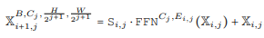
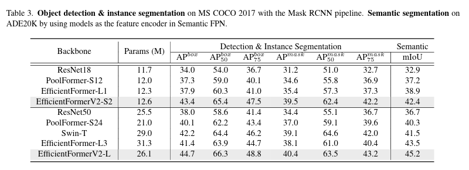

# EfficientFormerV2

### Abstract

​		这里的Abstract和V1的Abstract说的话基本一样，还是说VIT由于其大参数，高延迟的特性没办法在资源受限的移动设备上进行使用，并且前人已经为基于VIT研究了很多衍生策略去解决这种问题，虽然有提升但在实际应用中还是无法比过CNN网络。所以他们提出了一个中心问题：**Transformer结构的模型是否可以像MobileNet一样快速运行并保持和MobileNet相似的参数**。接下来他们针对VIT结构进行研究并提出了自己的新网络，EfficientFormerV2，并且在实验中表现优异。

### 1.Introduction

​		这段话主要说了VIT的表现激发了很多后续工作，如在图像分割，图像识别任务上，都取得了非常好的效果。并且提出了VIT性能优异的本质来源于多头注意力机制（MHSA），MHSA能有效模拟2D图像中的空间依赖性，从而实现全局接受域，同时还可以学习二阶信息。但是他的缺点就是计算复杂度随着分辨率的增加呈现次方级的增长，这也是它无法在资源受限的设备上运行的重要原因。

​		很多研究想去减轻这种限制，像SwinTransformer提出了一种窗口化注意力机制，这些方法很有效的将计算量与分辨率变成了线性关系，很大幅度的减少了计算量。然而有了这些优化还是无法使它在资源受限的设备上运行，因为复杂的注意力模式通常很难在移动设备上支持或加速，因为需要进行大量的形状变换和索引操作。另一种方法就是将轻量级的CNN与Transformer结构进行混合，但是这种方法跟MobileNet相比在速度，性能，大小方面总有一些点不如他。所以，一个很有挑战性的问题就是：**我们是否可以设计出一个又轻量又快速并且表现好的Transformer的模型。**

​		之后，他们就设计出了EfficientFormerV2，他们做出了三点贡献：

​		1.提供了一项全面的研究，以验证和改进适合移动设备的设计选择。

​		2.我们提出了一种精细的联合搜索算法，可以同时优化模型大小和速度。

​		3.提出的模型EfficientFormerV2模型系列在各种下游任务中实现了超快速的推理和超小的模型大小。

### 2.Related Work

​		这段主要说了对于VIT的一些过往研究和努力。并且最后总结出了VIT的两个缺点，第一个是很多优化算法无法应用在手机这种设备上。第二个就是混合模型这种做法主要优化了Pareto曲线，但是却总会有一点很弱，比如如果有快的速度，那他的模型就会大，也就是说无法全面的优化。

### 3.RethinkingHybrid Transformer Network

#### 3.1.TokenMixersvs.FeedForwardNetwork

​		这段先说在PooFormer和EfficientFormer这两种模型中使用的是3x3平均池化层作为token mixer，但研究发现，用同样大小的深度可分离卷积替换，不仅不会引入延迟，同时还将性能提升了0.6％。

​		此外，在近期的一些工作中发现，在VIT的FFN中加入3x3的深度可分离卷积，不仅可以提高性能，同时替代了token mixer的工作，所以我们可以去掉带有残差连接的token mixer，转而使用带有深度可分离卷积的FFN，这种结构在不减少延迟和增加参数的情况下，将准确率提高打了80.3%。

#### 3.2. Search Space Refinement

​		这段主要讲了在引入统一的FFN并去掉带有残差连接的token mixer后，以前的搜索空间是否还有效，特别在深度方面。经过实验发现，更深更窄的网络提高了0.2的准确度，减少了参数，减少了延迟。所以选择这个模型作为新的基准模型。

​		之后作者还讨论了是否使用进一步缩小分辨率的5阶模型的VIT。通过实验发现，五阶段的模型准确度降低，参数更大，延迟更高，只有计算量减小了。这符合我们第五阶段的模型是计算高效，参数密集的直觉。作者最终坚持使用四阶段的设计。

#### 3.3. MHSA Improvements

​		之后他们对多头注意力机制进行了更改，一共有两点更改，第一点是在Value矩阵后使用一个3x3的深度卷积，以此向V矩阵中注入局部信息。第二点是在头维度（q*k）后增加一个全连接层，称为Talking Head，以此实现不同注意力头之间的通信。这些改动让准确度提高到了80.8%，并且延迟等参数几乎不变。

#### 3.4. Attention on Higher Resolution

​		这段主要说了注意力机制对性能是有好处的，但是，将注意力机制应用到高分辨率的时候会损害效率，因为其时间复杂度与空间分辨率呈现平方关系。基于3.3的基准网络，他们不仅在最后一层处（1/32的分辨率）处加入了注意力机制，同时在倒数第二层处（1/16)加入了注意力机制，但是结果是虽然提高了一些准确度，但是速度大大下降。所以得出结论，应该减少注意力模块的复杂度。

​		为了能在网络的早期也用到MHSA，作者提出了一种名叫Stride Attention的结构，这种结构，会先进行下采样至（1/32)，在经过玩注意力机制后，在上采样到原来的空间。这种结构与上一段说的在1/16处加入注意力机制相比，在把延迟从35ms减到15ms的的同时，只降低了0.02的准确度。

#### 3.5. Attention Downsampling

​		这一段主要提出了一种利用注意力机制进行下采样的方法，这种方法以前在其他的模型中就有提出，比如LeViT和UniNet，但是这种方法不能应用在网络初期的下采样中，并且将这种方法应用到移动设备上会带来高的计算负担。

​		所以，作者提出了一种局部性和全局依赖性的策略来进行下采样，用池化作为静态局部下采样，3x3的深度可分离卷积作为可学习（参数会变）的局部下采样，将这两种下采样结合起来投影到Query的维度，在最后的时候把下采样模块和一个一开始经过有步长卷积的模块连接起来，形成一种局部-全局的模式，这种方法将准确率提高到了81.8%，并且其他性能没有太大改变。

### 4.EfficientFormerV2

#### 4.1.Design of EfficientFormerV2

​		这里描述了EfficientFormerV2模型的结构和主要组件。首先，EfficientFormerV2采用了四阶分层设计，特征尺寸是输入分辨率的1/4，1/8，1/16和1/32。与EfficientFormerV1类似，EfficientFormerV2使用一个小的卷积核来进行图像的初始嵌入，而不是使用非重叠块的低效嵌入。

​		对于前两阶段，这些阶段在高分辨率上捕获本地信息，因此只使用统一的前馈神经网络（FFN）进行操作。定义为：

​		其中，i是层数，j是阶段数，Si,*j*是可学习的层缩放系数。FFN由两个属性构造：阶段宽度Cj和每块的扩展比率E**i*,*j*。每个FFN都是残差连接的。

​		在后两阶段，既使用本地的FFN又使用全局的多头自注意力（MHSA）块。因此，全局块的定义为：

​		其中，Proj表示投影函数，将每层的输出投影到与MHSA匹配的维度。

​		这样的设计使得模型在低分辨率阶段能够利用全局信息，同时在高分辨率阶段能够捕获本地信息，从而在保持计算效率的同时提升模型性能。

#### 4.2.Jointly Optimizing Modele Size and Speed

​		这一段指出了原始EfficientFormer模型的两个主要问题，并提出了他们的解决方案。

​		原始模型的两个问题是：

​			1.搜索过程仅受速度限制，导致最终模型在参数上存在冗余。也就是说，一些参数可能并没有对模型的性能产生显著影响，但却增加了模型的计算复杂度和内存需求。

​			2.原始模型的搜索算法只搜索深度（每个阶段的块数Nj）和阶段宽度Cj，这是一种粗粒度的方式。实际上，网络的大部分计算和参数都在前馈神经网络（FFN）中，并且参数和计算复杂度与其扩展比率Ei,j线性相关。Ei,j可以为每个FFN独立指定，而不需要是相同的。因此，搜索Ei,j可以使得在每个阶段内，计算和参数可以灵活且非均匀地分布。

​		所以作者提出了一种解决方案：提出一种搜索算法，该算法允许灵活的每块配置，同时对大小和速度进行联合约束，从而找到最适合移动设备的视觉骨干网络。

（后续具体算法日后在学习，这次主要熟悉模型）

### 5.Experiments

#### 5.1.ImageNet-1k Classification

​		**Implementation Details**：作者通过Pytorch 1.12，Timm库，16个A100的显卡去训练他们的模型，他们在ImageNet-1K数据集上训练300或450个epoch，使用的是AdamW优化器。学习率被设置为 10^−3，这个学习率是对应于每次训练的批次大小为1024。学习率在训练过程中会按照余弦衰减的方式减小。使用RegNetY-16GF作为蒸馏教师模型。使用了三个测试平台来评估模型的延迟性能，分别为iPone 12-NPU，Pixel6-CPU，Nvidia GPU。

​		**Evaluate on Single Metric**:EfficientV2在参数数量或者延迟等某一方面达到了SOTA。

​		与 EdgeViT-XXS 相比，EfficientFormerV2-S0 在 Top-1 准确率上提高了 13%，同时参数数量还减少了 0.6M。

​		与 MobileNetV2×10 相比，EfficientFormerV2-S0 在 Top-1 准确率上提高了 39%，而参数数量相似。

​		在更大的模型当中。

​		与EfficientFormer-L7相比，EfficientFormerV2-L与其准确率相似，同时参数量小了3.1倍。

​		在速度方面。

​		与 UniNet-B1 相比，EfficientFormerV2-S2 在具有相似或更低的延迟的情况下，其 Top-1 准确率提高了 0.8%。

​		与 EdgeViT-S 相比，EfficientFormerV2-S2 在具有相似或更低的延迟的情况下，其 Top-1 准确率提高了 0.6%。

​		与 EfficientFormer L1 相比，EfficientFormerV2-S2 在具有相似或更低的延迟的情况下，其 Top-1 准确率提高了 2.4%。

​		

​		**Jointly Optimized Size and Speed:**接下来检测EfficientFormerV2在同时考虑模型大小和速度时的优秀表现。在这里，使用了一个更实用的指标MES来评估移动设备的效率，而不仅仅是使用大小或延迟。

​		                         

​		

​		EfficientFormerV2-S1在MES上大幅超过了MobileViT-XS、EdgeViT-XXS、和EdgeViT XS，分别在Top-1准确率上提高了42%、46%和15%。

​		EfficientFormerV2L在MES上高出很多，其MES高出MobileFormer-508M的18倍，而在Top-1准确率上提高了40%。

​	

#### 5.2.Downstream Tasks

​		**Object Detection and Instance Segmentation:**将EfficientFormerV2作为Mask-RCNN的主干网络，并在MSCOCO2017数据集上进行实验。模型使用ImageNet-1K预训练权重初始化，使用AdamW优化器，初始学习率为2×10^-4，训练模型12个epoch，分辨率为1333×800。

​		结果显示。

​		与模型大小相近的PoolFormer-S12相比，EfficientFormerV2-S2在AP box和AP mask上分别提高了6.1和4.9。EfficientFormerV2-L在AP box和AP mask上分别超过了EfficientFormer-L3的3.3和2.3。

​		**Semantic Segmentation：**将EfficientFormerV2应用到ADE20K数据集，包含150个类别。他们将EfficientFormerV2作为Semantic FPN的特征编码器，并使用ImageNet-1K预训练权重。模型在ADE20K上训练了40K次，批次大小为32，学习率为2×10^-4，并使用0.9的指数进行poly decay。结果显示，EfficientFormerV2-S2在mIoU上比PoolFormer-S12和EfficientFormer-L1分别提高了5.2和3.5。

#### 5.3.Ablation on Search Algorithm

​		这段文字比较了作者提出的搜索算法和EfficientFormer中的原始搜索算法。结果显示，他们的搜索算法得到的模型与EfficientFormer的模型在参数和延迟上相似，但准确率更高。这证明了细粒度搜索和延迟大小的联合优化的有效性。

### 6.Discussion and Conclusion

​		在这次工作中，作者详细研究了混合网络模型，并验证了对移动设备友好的设计选择。他们进一步提出了对大小和速度进行细粒度联合搜索，并获得了既轻量又超快的EfficientFormerV2模型家族。由于为简单起见，此次主要关注大小和速度，所以未来的一个方向是将联合优化方法应用于探索其他关键指标的后续研究，如内存占用和CO2排放。

