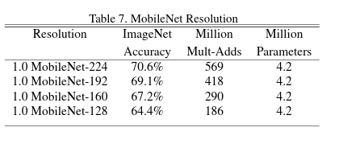
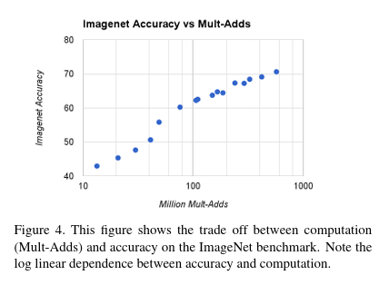
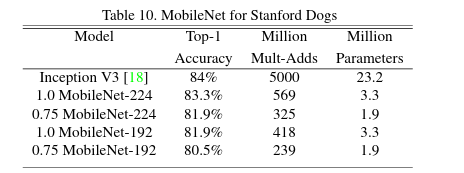
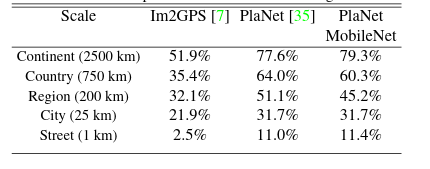
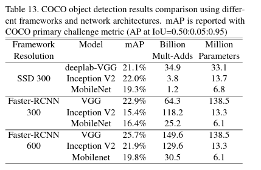
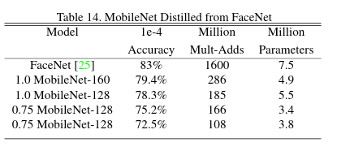

# MobileNetv1论文阅读笔记

### Abstract

​	在Abstract部分，作者表明他们提出了一种名为MobileNet的模型，这个模型可以适用于手机或者一些嵌入式设备。MobileNet使用一种流线型结构，这个结构中用到了深度可分离卷积。他们会用到两个超参数，这两个超参数可以有效的平衡速度以及准确性的问题。用户可以根据自己碰到的问题自行调整这些超参数。他们还做了很多关于资源使用和准确率的平衡的实验，与其他模型相比，在图像分割方面有着很好的表现。他们之后又证明了MobileNet在很多不同领域的有效性。

### 1.Introduction

​	在Introduction部分，作者首先指出现在的卷积神经网络自从AlexNet赢得2012年图像识别的比赛后，模型就普遍往更深更复杂的方向发展，为了更高的准确率。但是这种优势只能提高准确率，但不能在模型大小和速度方面体现效果。在很多现实的情况，比如机器人，自动驾驶，现实增强（AR）,识别任务，在这些项目中，识别任务需要在计算能力有限的平台上运行。

### 2.Prior Work

​	小模型网络在最近的文章中越来越受到关注。构建小网络的方法大致可分为两类，一类是压缩预训练模型，另一类是直接训练小模型。这篇文章提出一种网络，使模型开发者可以特别选择一种与他们应用的资源限制（延迟，大小）相匹配的小网络。MobileNets 主要关注优化延迟，但同时也生成了小型网络。许多关于小网络的文章只关注大小，但并未考虑速度。

​	MobileNets 主要是由最初在 中引入的深度可分离卷积构建的，并随后在 Inception 模型中使用，以减少前几层的计算量。扁平化网络由完全因子化的卷积构建网络，展示了极度因子化网络的潜力。与当前这篇文章独立，因子化网络引入了类似的因子化卷积以及拓扑连接的使用。随后，Xception网络展示了如何扩展深度可分离滤波器以超越 Inception V3 网络的性能。另一个小型网络是 Squeezenet，它采用瓶颈方法设计了一个非常小的网络。其他减少计算量的网络包括结构化变换网络和深度fried卷积网络 。

### 3.MobileNet Architecture

​	在本节中，我们首先描述 MobileNet 的核心层，即深度可分离卷积。然后我们描述 MobileNet 的网络结构，并以对两个模型缩小超参数——宽度乘数和分辨率乘数的描述作为结论

#### 3.1.Depthwise Separable Convolution

​	MobileNet模型基于深度可分离卷积，这是一种因子化卷积的形式，它将标准卷积因子化为深度卷积和1x1的点卷积。对于MobileNet而言，深度卷积是对单个的通道使用单独的滤波器，之后再用一个1x1的点卷积来结合深度卷积的输出。标准的卷积会将滤波与组合结果在一步中进行。深度可分离卷积分离了这个步骤到两层进行，一层负责滤波，另一层负责结合结果。这种因子化的卷积大大的减少了计算量以及模型的尺寸。

之后就是对比标准卷积以及深度可分离卷积的计算量

上边的图片是标准卷积的过程，每一个卷积核中有若干个filter，这个filter的个数与输入的通道数相同，每个filter的大小与我们想要输出的大小有关，卷积核的个数和输出通道数相同。所以针对上图来说，它的计算量应该为：

​						卷积核大小(宽度或高度)x卷积核大小x输入通道数x输出通道数

上边的图片是深度可分离卷积中深度卷积的过程，这是一个逐通道卷积的过程，一个filter对应一个通道。所以它的计算量为：

​							卷积核大小x卷积核大小x输入通道数

上边的图片是深度可分离卷积中逐点卷积的过程，这是一个将深度卷积生成出来的分散的结果进行结合的一个过程，在这个过程与标准卷积没有区别，只是使用卷积核大小为1*1的卷积核进行卷积。所以逐点卷积的计算量为：

​						1x1x输入通道数(因为深度可分离卷积后的通道数一定与输入通道数相同)*输出通道数

所以整个深度可分离卷积的计算量为：

​						卷积核大小x卷积核大小x输入通道数+1x1x输入通道数*输出通道数

将标准卷积与深度可分离卷积的计算量进行一个比，不难计算，深度可分离卷积的参数是标准卷积的

​						1/输出通道数+1/卷积核大小平方

#### 3.2 Network Structure and Training

​		MobileNet除了第一层是全卷积其他都是由深度可分离卷积组成的，因为有如此简单的网络结构定义，我们可以更轻松的探索好的网络结构。MobileNet的所有层后边都跟着归一化层和激活函数层(ReLu)。除了最后的全连接层，他没有非线性部分，并输入到一个softmax层进行分类。图 3 将具有标准卷积、归一化和激活函数层(ReLu)与具有深度卷积、点卷积并且每个卷积层后有归一化层和激活函数层（ReLu）的因子化层进行对比。下采样是通过在深度卷积以及在第一层中的带步长的卷积来处理的。一个最终的平均池化将空间分辨率降低到1，然后是全连接层。将深度卷积和点对点卷积计为单独的层，MobileNet 共有28层。

​		仅仅以少量的乘加操作定义网络是不够的。还需要确保这些操作可以被高效地实现。例如，非结构化稀疏矩阵操作通常不会比密集矩阵操作更快，除非达到非常高的稀疏度。我们的模型结构将几乎所有的计算放入了密集的 1x1 卷积中。这可以通过高度优化的通用矩阵乘法（GEMM）函数来实现。通常，卷积是通过 GEMM 实现的，但需要在内存中进行初始的重新排序，称为 im2col，以便将其映射到 GEMM。例如，这种方法在流行的 Caffe 包中被使用。1x1 卷积不需要这种内存重新排序，并且可以直接使用 GEMM 实现，这是最优化的数值线性代数算法之一。MobileNet有75%的参数在 1x1 卷积中并且花费了95%的计算时间去计算这些1x1卷积。剩下几乎所有的额外参数都在全连接层中。

​		MobileNet 模型在 TensorFlow中使用 RMSprop和异步梯度下降进行训练，这与 Inception V3 类似。然而，与训练大型模型相反，我们使用更少的正则化和数据增强技术，因为小型模型不太可能过拟合。在训练 MobileNets 时，我们不使用辅助头（side heads）或标签平滑（label smoothing）。并且通过限制用于大型 Inception 训练的小裁剪的大小，进一步减少了图像失真的数量。此外，我们发现，对深度卷积施加很少或没有权重衰减（l2 正则化）是很重要的，因为它们的参数数量很少。在下一节的 ImageNet 基准测试中，所有模型都使用相同的训练参数进行训练，无论模型的大小如何。

**名词解释** ：1.GEMM：GEMM 是 General Matrix to Matrix Multiplication（通用矩阵乘法）的缩写。这是一种基本的线性代数操作，用于两个矩阵的乘法。

​					2.RMSprop：RMSProp是一种用于优化神经网络权重的算法，代替普遍使用的SGD优化器。

​				    3.辅助头（side heads）：用于在网络中间层添加输出层，形成额外的输出，用来计算辅助损失函数，可以缓解梯度消失的问题。

​					4.标签平滑（label smoothing）:标签平滑是一种正则化技术，用于使模型对其预测的信心降低一些。通过标签平滑，我们稍微改变目标标签，将一部分的质量从正确的类别移动到其他类别（例如，对于一个 5 类问题，我们可能将正确类的目标从 1.0 改为 0.9，然后将剩余的 0.1 均匀地分布到其他 4 类）。这可以防止模型过于自信，有助于模型的泛化能力。

**我的理解**：相比于普通卷积，MobileNet在深度卷积与点卷积后边都加入了归一化层与激活函数层，这有助于在减少参数量的同时尽量保持模型的准确性，归一化层保持训练稳定，增加模型泛华能力，激活函数层增加网络非线性表达能力。

​					MobileNet的计算量主要集中在1x1的卷积，所以如果相对这个模型再度优化，可以多想想什么可以让这个1x1的卷积计算的更快。

​					MobileNet尽量不使用防止过拟合的技术，因为其本身参数量就少，无法很好的拟合数据，如果使用过拟合技术只会让它无法拟合出任何东西。

#### 3.3. Width Multiplier：Thinner Models

​		尽管基础的 MobileNet 架构已经足够小且延迟低，但很多时候，特定的使用场景或应用可能需要模型更小、更快。为了构造这些更小、计算代价更低的模型，我们引入了一个非常简单的参数，叫做widthmultiplier α。α的作用是在每层都均匀地减小网络的宽度。α会让输入通道数变为αM，会让输出通道数变为αN。

​		其中，α在 (0,1] 范围内，典型的设置是1,0.75,0.5 和 0.25。α等于1时是基础MobileNet，小于1时是缩小的MobileNets。α有减少计算成本和参数数量的效果，大致上，减少的比例是α的平方。α可以应用于任何模型结构以定义一个新的、更小的模型，这个模型有合理的精度、延迟和大小权衡。它被用于定义一个需要从头开始训练的新的减小的结构。

**我的理解**：这个α其实就是减少输入的通道数，通道数越多，能表示的数据信息也就越多，所以这是一个拿数据信息量换速度的过程，我认为选取0.75和0.5相对合适一些，选取0.25会损失太多的数据信息。

#### 3.4.Resolution Multiplier：Reduced Representation

​		第二个减少网络计算成本的超参数是resolutionmultiplier ρ 。我们将他应用到输入图像，在每层内部也相应减少相同的倍数。在实际应用时，我们通道调整分辨率来隐式的设置这个ρ。

​		ρ在 (0,1] 范围内，通常是隐式设置的，输入分辨率会变为 224, 192, 160 或 128。当分辨率乘数等于 1 时，是基准MobileNet，小于 1 的是计算量减少的 MobileNets。分辨率乘数可以将计算成本减少大约 ρ的平方。下面展示一个应用α和ρ如何减少计算量的例子。

**我的理解**：与α同理，ρ也是通过减少信息量来换取模型更小，速度更快的，只是ρ是减少了图像分辨率上的信息。

### 4.Experiment

​	在这一节我们首先研究深度可分离卷积的作用以及在缩小网络时选择减少网络宽度而不是减少层数所带来的影响。然后，我们展示了基于两个超参数α和ρ之间的权衡，并将结果与一些流行模型进行比较。然后，我们研究了将MobileNets应用于多种不同应用的情况

#### 4.1.Model Choices

​	首先，我们比较了使用深度可分离卷积的MobileNet与使用全卷积构建的模型。在表4中，我们看到，与全卷积模型相比，使用深度可分离卷积在 ImageNet 上只减少了 1% 的精度，但在乘加运算和参数上节省了大量的成本

​	接下来，我们将使用带有α的更瘦的MobileNet与使用较少层数的MobileNet模型进行比较。为了使 MobileNet 更浅，我们移除了表 1 中5层特征大小为 14x14x512 的卷积 。表 5 显示，在类似的计算和参数数量下，使用了α的MobileNets 比浅层的MobileNet在准确率上要好3%。（这里边α选择0.75）

**我的理解**：从这里的实验对比不难看出，使用了MobileNet之后准确率降低的很少，只有百分之1，但参数量和计算量都有着数倍的减小，这很符合轻量级模型的要求，在尽可能保存准确度的情况下减少参数。

如果我们想使用更小的模型，相比于直接减少层数，更有效的方法是使用超参数α，二者的参数量和计算量差不多，但是能有3的准确率增幅。

#### 4.2.Model Shrinking Hyperparameters

​	表6显示了通过α缩小MobileNet模型时的准确性、计算量和模型大小的权衡。准确性随着α下降而平滑下降，直到α等于 0.25 时准确率变得过小。

​	表7显示了通过ρ（缩小分辨率）缩小MobileNet模型时的准确性、计算量和模型大小的权衡。准确性随着ρ下降而平滑下降。

**我的理解**：α和ρ这两个参数是我们想再次缩小MobileNet时的重要参数，但从实验结果可以看出，ρ可以随着想减小的程度而随意减小，不会出现准确率的大幅下降，但α尽量不能选到0.25，这会大大降低准确率。

​	图4显示了16种模型（α取它的4个值，ρ取它的四个值）的准确率和计算量之间的权衡。结果呈现出对数函数的模式，但在α=0.25时会出现一个跳跃。

​	图5显示了16种模型（α取它的4个值，ρ取它的四个值）的准确率和参数量之间的权衡。

**我的理解**：这里说了减小参数量与ρ（也就是减少分辨率）没有太大关系，主要与α有关。

​	表8比较了完整的MobileNet和GoogleNet以及VGG16。MobileNet与VGG16的准确率非常接近，但是比它参数量小32倍，计算量小27倍。比GoogleNet的准确率要高，计算量比GoogleNet少2.5倍。

​	表9比较了α=0.5以及ρ（分辨率）为160的缩小版MobileNet与AlexNet和Squeeznet。MobileNet比AlexNet准确率高百分之4，参数量小45倍，计算量少9.4倍。对比Squeeznet，同样准确率高百分之4，参数量和计算量都少了22倍。

#### 4.3.Fine Grained Recognition

​	我们在Stanford Dogs数据集上训练 MobileNet 进行细粒度识别。我们扩展了 [18]论文中提出的方法，从网上收集了比[18]里更大但噪声更大的训练集。我们使用这些带噪声的网页数据预训练一个细粒度的狗类识别模型，然后在 Stanford Dogs 训练集上对模型进行微调。Stanford Dogs 测试集的结果在表10中。MobileNet 几乎可以达到[18]论文中的最先进结果，但计算量和大小大大减少。

#### 4.4.Large Scale Geolocalizaton

​	PlaNet将确定某照片拍摄地点的任务视为一个分类问题。该方法将地球划分为地理单元格的网格，这些单元格作为目标类别，并在数百万的带标记的地理照片上训练卷积神经网络。已经证明，PlaNet 成功定位了各种照片，并且在处理同样任务的 Im2GPS [6,7] 上表现优异。

​	我们重新训练了PlaNet，使用MobileNet结构在相同的数据上训练。基于Inception V3结构的PlaNet有5200万参数，57.4亿次计算。而MobileNet只有1300万参数，其中300万参数属于主干，1000万参数属于最后一层；有58万次计算。尽管MobileNet更为小巧，但其性能只比 PlaNet 略有下降。并且它，大大超过了 Im2GPS。

#### 4.5.Face Attributes

​	MobileNet的另一个使用场景是压缩具有未知或深奥训练过程的大型系统。在面部属性分类任务中，我们展示了 MobileNet 和蒸馏(一种深度网络的知识转移技术)之间的协同关系。我们试图减小一个具有 75 百万参数和 1600 百万乘加运算的大型面部属性分类器。该分类器在类似于 YFCC100M 的多属性数据集上进行训练。

​	我们使用 MobileNet 架构蒸馏一个面部属性分类器。蒸馏的工作原理是训练分类器模仿更大模型的输出，而不是真实标签，从而使得可以从大的无标签数据集中进行训练。结合了蒸馏训练的可扩展性和 MobileNet 的参数简化，最终系统不仅不需要任何正则化（例如权重衰减），而且还展现出更强的性能。从表12可以看出，基于 MobileNet 的分类器对于激进的模型缩小具有弹性：它在消耗仅为原始模型 1% 的乘加运算的同时，实现了与原始模型相似的属性平均精度。

#### 4.6.Object Detection

​	MobileNet 也可以作为现代物体检测系统中有的主干网络。我们报告了在 COCO 数据（基于最近 2016 COCO 挑战赛的工作）上训练的 MobileNet 用于物体检测的结果。在表 13 中，MobileNet 与 VGG和Inception V2在Faster-RCNN和 SSD框架下进行了比较。在我们的实验中，使用 300 的输入分辨率评估 SSD（SSD300），Faster-RCNN 与 300 和 600 的输入分辨率进行了比较（Faster-RCNN300，Faster-RCNN600）。Faster-RCNN 模型每张图像评估 300 个 RPN 提议框。这些模型在排除 8k minival 图像的 COCO train+val 上进行训练，并在 minival 上进行评估。对于这两个框架，MobileNet 都以只有其他网络一小部分的计算复杂性和模型大小实现了与其他网络相当的结果。

#### 4.7.Face Embeddings

​	FaceNet 模型是一种先进的面部识别模型。它基于三元组损失构建面部嵌入。为了构建移动 FaceNet 模型，我们使用蒸馏在训练数据上通过最小化 FaceNet 和 MobileNet 输出的平方差来训练。非常小的 MobileNet 模型的结果可以在表14中找到。

### 5.Conclusion

​	我们提出了一种新的模型架构，称为 MobileNets，它基于深度可分离卷积。我们研究了一些导致模型有效的重要设计决策。然后，我们演示了如何使用α和ρ构建更小、更快的 MobileNets，通过合理地牺牲一些精度来换取尺寸和延迟的减小。然后，我们将不同的 MobileNets 与流行模型进行比较，展示出其优越的尺寸、速度和精度特性。我们通过展示 MobileNet 在应用到各种任务时的有效性来结束。作为下一步帮助 MobileNets 的采纳和探索，我们计划在 Tensor Flow 中发布模型。
