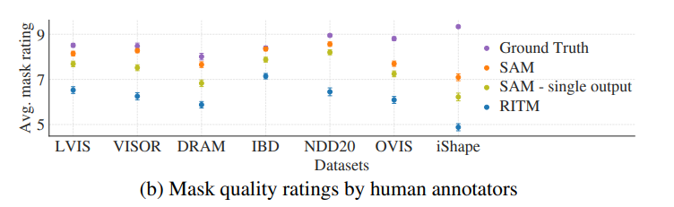

# Segment Anything论文阅读笔记

### Abstract

​	我们介绍了“Segment Anything项目”：一个新的图像分割任务、模型和数据集。利用我们高效的模型进行数据采集，我们建立了迄今为止最大的分割数据集，其中包含超过10亿个掩模，覆盖1100万获得许可且尊重隐私的图像。该模型被设计并训练为可提示的，因此它可以零次迁移至新的图像分布和任务。我们评估了其在多种任务上的能力，并发现其零次迁移的表现令人印象深刻 - 往往与之前的全监督结果相媲美，甚至超过。

**Promptable：**能够根据给定的提示动态地执行多种任务，而不是仅仅为一个特定任务进行预训练。比如给一个模型一个图片和文本提示，例如：“画一个红色的圆圈”，然后模型会在图像上画出一个红色的圆圈。

### 1.Introduction

​		在大规模的网络数据集上进行预训练的大型语言模型正在带来自然语言处理的革命，尤其是在零样本（zero-shot）和少样本（few-shot）的泛化方面表现出强大的能力。这些**"foundation model"**可以泛华训练过程中未见过的任务和数据分布，这种能力通常通过**提示工程**来实现，其中手工编写的文本被用来提示语言模型为手头的任务生成一个有效的文本响应。当这些模型扩展并使用来自网络的大量文本语料库进行训练时，它们的零样本和少样本性能与经过**微调的模型**相比令人惊讶地好（在某些情况下甚至相匹敌）。实验趋势显示，随着模型规模、数据集大小和总体训练计算量的增加，这种能力会更强。

**fine-tune model（模型微调）：**这个指的是已经在大量数据上进行过预训练的模型，然后在某个具体任务的较小数据集上进行进一步的训练，以使其更好地适应该特定任务。

**提示工程：**上面所说的Promptable。

​		"foundation model"也已经在计算机视觉领域进行了探索，尽管程度较小。最突出的例子是将网上的配对文本和图像对齐。例如，CLIP [82] 和 ALIGN [55] 使用对比学习来训练文本和图像编码器，使这两种模态对齐。一旦训练完成，经过设计的文本提示可以实现对新的视觉概念和数据分布的零样本泛化。这样的编码器还可以与其他模块有效地组合，以实现下游任务，如图像生成。尽管在视觉和语言编码器上取得了很大的进展，但计算机视觉包括超出此范围的广泛问题，而且对于其中许多问题，并不存在丰富的训练数据。

​		在这项工作中，我们的目标是为图像分割构建一个"foundation model"。也就是说，我们寻求开发一个可提示的模型，并在一个广泛的数据集上预训练它，使用一个能够实现强大泛化的任务。有了这个模型，我们希望使用提示工程在新的数据分布上解决一系列的下游分割问题。

这个计划的成功取决于三个组件：任务、模型和数据。为了开发它们，我们讨论了关于图像分割的以下问题：

1. 什么任务将实现零样本泛化？
2. 相应的模型架构是什么？
3. 什么数据可以支持这个任务和模型？

​		这些问题是相互交织的，需要一个综合的解决方案。我们首先定义一个可提示的分割任务，这个任务足够通用，既可以提供一个强大的预训练目标，又可以支持各种下游应用。这个任务需要一个支持灵活提示的模型，并且在被提示时可以实时输出分割结果，以便于交互式使用。为了训练我们的模型，我们需要一个多样化、大规模的数据源。

​		不幸的是，对于分割来说，并没有一个网页规模的数据源；为了解决这个问题，我们构建了一个“数据引擎”，即，我们在使用我们高效的模型协助数据收集和使用新收集的数据来改进模型之间进行迭代。接下来，我们将介绍每一个相互连接的组件，然后是我们创建的数据集和证明我们方法有效性的实验。

​		**Task（第二节）：**在自然语言处理和最近的计算机视觉中，"foundation model"是一个有前景的发展，它可以为新的数据集和任务进行零样本和少样本学习，通常通过使用“提示”技术。受到这一工作的启发，我们提出了可提示的分割任务，其目标是给定任何分割提示后返回一个有效的分割mask。提示简单地指定了在图像中要分割的内容，例如，提示可以包括识别对象的空间或文本信息。有效输出mask的要求意味着，即使一个提示是模糊的并且可能指向多个对象（例如，指向衬衫上的一个点可能指的是衬衫或穿衬衫的人），输出应该是至少其中一个对象的合理结果。我们使用可提示的分割任务作为预训练目标，并通过提示工程解决通用的下游分割任务。

​		**Model（第三节）：**可提示的分割任务和实际使用的目标对模型架构增加了约束。特别是，模型必须支持灵活的提示工程，需要实时的计算mask以允许交互式使用，并且必须能够进行模糊感知。令人惊讶的是，我们发现一个简单的设计满足了上面所说的三个约束：一个强大的图像编码器计算图像嵌入，**一个提示编码器嵌入提示，然后在一个轻量级的mask解码器中组合这两个信息源来预测分割遮罩。我们将此模型称为Segment Anything Model，或SAM**（见下图）。通过将SAM分为图像编码器，快速的提示编码器和mask解码器，可以让相同的图像嵌入被不同的提示重复使用。给定一个图像嵌入，提示编码器和mask解码器在网络浏览器中用约50ms从一个提示中预测一个mask。我们重点关注点、框和mask提示，并初步展示了自由形式文本提示的结果。为了使SAM能够识别模糊性，我们设计它为单一提示预测多个mask，使SAM能够自然地处理模糊性，如衬衫与人的例子。

​		**Data engine（第四节）：**为了在新的数据分布上实现强大的泛化能力，我们发现有必要在一个大而多样的mask集上训练SAM，这超出了任何已经存在的分割数据集。虽然"foundation model"的典型方法是在线获取数据，但mask并不是自然丰富的，因此我们需要一个替代策略。我们的解决方案是构建一个“数据引擎”，也就是说，我们与模型循环数据注释共同开发我们的模型（见下图）。我们的数据引擎分为三个阶段：辅助手工、半自动和全自动。在第一阶段，SAM协助注释者标注mask，类似于经典的交互式分割设置。在第二阶段，SAM可以通过提示可能的物体位置自动为一部分物体生成遮罩，而注释者专注于标注剩余的物体，帮助增加mask的多样性。在最后一个阶段，我们用一个规则的前景点网格提示SAM，每张图像平均产生约100个高质量的遮罩。

​		**Dataset（第五节）：**我们的最终数据集SA-1B包含了来自1100万个经许可且保护隐私的图像的超过10亿个mask。完全自动收集的SA-1B使用我们数据引擎的最后阶段，其mask数量是任何现有分割数据集的400倍，正如我们广泛验证的，这些mask质量高且多样性丰富。除了用于训练SAM以增强其鲁棒性和泛化能力，我们希望SA-1B成为为构建新的"foundation model"的研究提供宝贵资源。

​		**Responsible AI（第六节）：**我们研究并报告了在使用SA-1B和SAM时可能存在的公平性问题和偏见。SA-1B中的图像涵盖了地理和经济多样化的国家集合，我们发现SAM对不同群体的人们的表现相似。总的来说，我们希望这将使我们的工作在实际应用中更加公平。

​		**Experiments（第七节）：**我们对SAM进行了广泛的评估。首先，使用一个包含23个分割数据集的新的多样化测试套件，我们发现SAM可以从一个前景点产生高质量的mask，其质量往往仅略低于手动标注的真实地面。其次，我们在使用提示工程进行零样本迁移协议的各种下游任务上都找到了持续强劲的定量和定性结果，包括边缘检测、物体提议生成、实例分割，以及对文本到mask预测的初步探索。这些结果表明，SAM可以在不涉及SAM训练数据的情况下，通过提示工程直接用于解决涉及物体和图像分布的各种任务。尽管如此，仍然有改进的空间，我们将在第8节中进行讨论。

### 2.Segment Anything Task

​		我们从自然语言处理中汲取灵感，其中下一个标记预测任务被用于"foundation model"的预训练和通过提示工程来解决各种下游任务。为了构建一个用于分割的基础模型，我们的目标是定义一个具有类似功能的任务。

​		**Task:**我们首先将自然语言处理中的提示的概念转化为分割，其中提示可以是一组前景/背景点、粗略的框或mask、自由格式的文本，或者通常是指示在图像中分割什么的任何信息。那么，可提示的分割任务就是给定任何提示后返回一个有效的分割mask。"有效"mask的要求意味着，即使一个提示是模糊的并且可能指代多个对象，输出应该是至少其中一个对象的合理mask。这个要求与期望语言模型对模糊提示输出一个连贯的响应类似。我们选择这个任务，因为它提出了一个自然的预训练算法和一个通过提示实现对下游分割任务的零样本迁移的通用方法。

​		**Pre-training：**可提示的分割任务提出了一个自然的预训练算法，该算法为每个训练样本模拟一系列的提示（例如，点、框、mask），并将模型的mask预测与真值进行比较。我们从交互式分割中调整了这种方法，尽管与交互式分割的目标不同，交互式分割的目标是在足够的用户输入之后最终预测出一个有效的遮罩，而我们的目标是始终为任何提示预测出一个有效的mask，即使提示是模糊的。这确保了预训练的模型在涉及歧义的使用情境中是有效的，包括我们的数据引擎所要求的自动注释。我们注意到，要在这个任务上表现出色是具有挑战性的，并需要专门的建模和训练损失选择，我们将在第三节中讨论。

​		**Zero-shot transfer:**直观地说，我们的预训练任务使模型具备了在推断时对任何提示作出适当反应的能力，因此下游任务可以通过适当的工程化提示来解决。例如，如果有人有一个用于猫的边界框检测器，猫的实例分割可以通过将检测器输出的框作为提示提供给我们的模型来解决。总的来说，许多实际的分割任务都可以被视为提示。除了自动数据集标注外，我们在第七节的实验中探讨了五个不同的示例任务。

​		**Related tasks：**分割是一个广泛的领域：有交互式分割、边缘检测、超像素化、对象提议生成、前景分割、语义分割、实例分割、全景分割等。我们的可提示分割任务的目标是生产一个广泛有能力的模型，该模型可以通过提示工程适应许多现有和新的分割任务。这种能力是任务泛化的一种形式。请注意，这与先前关于多任务分割系统的工作不同。在多任务系统中，单一模型执行一系列固定的任务集，例如，联合语义、实例和全景分割，但是它们训练和测试的任务是相同的。我们工作中的一个重要区别是，为可提示分割训练的模型可以在推理时执行新的、不同的任务，作为一个更大系统中的组件，例如，为了执行实例分割，可提示分割模型与现有的对象检测器结合。

​		**Discussion：**提示和组合是强大的工具 ，可以使单一模型以可扩展的方式使用，可以用于在面对未知任务时的模型设计。这种方法与其他基础模型的使用方式相似，例如，CLIP 是 DALL·E 图像生成系统的文本-图像对齐组件。我们预期，由提示工程等技术提供支持的可组合系统设计将比专为固定任务集训练的系统实现更广泛的应用。通过组合的角度比较可提示分割和交互式分割也很有趣：虽然交互式分割模型是考虑到人类用户而设计的，但为可提示分割训练的模型也可以组合成一个更大的算法系统，正如我们将展示的那样。

### 3.Segment Anything Model

​		接下来我们将描述用于可提示分割的“Segment Anything Model”（SAM）。SAM 有三个组件，如下图所示：一个图像编码器、一个灵活的提示编码器和一个快速的mask解码器。我们基于 Transformer 视觉模型 ，具有特定的权衡方法，以实现（平摊的）实时性能。

​		**Image encoder：**受到可扩展性和强大的预训练方法的激励，我们使用了一个经过预训练的 MAE 视觉变换器 (ViT) ，并进行了微小的调整来让模型处理高分辨率输入。图像编码器会对每张图像进行一次编码，并且可以在提示模型之前应用。

​		**Prompt encoder：**我们考虑了两组提示：稀疏的（点、框、文本）和密集的（mask）。我们使用位置编码表示点和框，并与每种提示类型的学习嵌入相加，使用 CLIP中的现成文本编码器表示自由格式的文本。密集提示（mask）使用卷积进行嵌入，并与图像嵌入按元素方式相加。

​		**Mask decoder：**mask解码器高效地将图像嵌入、提示嵌入以及一个输出令牌映射到一个mask。这种设计受到了 [14, 20] 的启发，采用了一个变形的 Transformer 解码器块 ，后面跟随了一个动态mask预测头。我们修改后的解码器块使用提示自注意力和交叉注意力在两个方向上来更新所有嵌入。在运行两个块之后，我们对图像嵌入进行上采样，然后一个MLP将输出令牌映射到一个动态线性分类器，该分类器随后在每个图像位置计算遮罩前景的概率。

​		**Resolving ambiguity：**对于一个输出，如果给出了一个模糊的提示，模型会对多个有效的mask进行平均。为了解决这个问题，我们修改模型，使其对一个单一的提示预测多个输出mask。我们发现3个mask输出足以解决大多数常见情况（嵌套mask通常最多有三层深度：整体、部分和子部分）。在训练过程中，我们只对mask的最小损失进行反向传播。为了对遮罩进行排序，模型为每个遮罩预测一个置信度得分（估计的IoU）。

​		**Efficiency：**整体的模型设计主要是出于效率的考虑。给定一个预先计算好的图像嵌入，提示编码器和mask解码器可以在网络浏览器上的CPU上运行，用时约50毫秒。这样的运行时间性能使得我们的模型能够无缝地、实时地进行交互式提示。

​		**Losses and training：**我们使用 focal loss和dice loss的线性组合来监督mask预测。我们为可提示的分割任务进行训练，使用的是几何提示的混。按照[92, 37]的做法，我们通过在每个mask的11轮中随机采样提示来模拟一个交互式设置，使SAM能够无缝地集成到我们的数据引擎中。

### 4.Segment Anything Data Engine

​		由于互联网上的分割mask不是很丰富，我们构建了一个数据引擎来收集我们的1.1Bmask数据集，SA-1B。这个数据引擎有三个阶段：(1) 第一个阶段是用模型来辅助手动注释的阶段；(2) 第二个阶段是一个半自动阶段，其中包含自动预测的mask和模型辅助的注释的混合；(3)第三个阶段是一个完全自动的阶段，其中我们的模型在没有注释者输入的情况下生成mask。接下来我们将详细介绍每个阶段。

​		**Assisted-manual stage:**在第一阶段，类似于传统的交互式分割，一个专业注释者团队使用由SAM驱动的基于浏览器的交互式分割工具，通过点击前景/背景对象点来标记mask。可以使用像素精确的“画笔”和“橡皮擦”工具来修正mask。我们的模型辅助注释在浏览器内直接实时运行（使用预计算的图像嵌入），提供了真正的交互式体验。我们没有对标记对象施加语义约束，注释者可以自由地标记“杂物”和“东西”。我们建议注释者标记他们能命名或描述的对象，但没有收集这些名称或描述。要求注释者按突出程度顺序标记对象，并鼓励一旦注释一个mask超过30秒就进入下一张图片。

​		在这个阶段开始时，SAM是使用常见的公共分割数据集进行训练的。在足够的数据注释之后，仅使用新注释的mask对SAM进行了重新训练。随着更多的mask被收集，图像编码器从ViT-B扩展到ViT-H，并且其他架构细节也发生了变化；我们总共重新训练了我们的模型6次。随着模型的改进，每个mask的平均注释时间从34秒减少到14秒。我们注意到，14秒是COCO 的mask注释速度的6.5倍，而且只比使用极点标记的边界框标记慢2倍。随着SAM的改进，每张图像的平均mask数量从20增加到44个mask。总的来说，在这个阶段，我们从120k的图像中收集了4.3M个mask。

​		**Semi-automatic stage：**在这个阶段，我们的目标是增加mask的多样性，以便提高我们的模型的分割任何物体的能力。为了让注释者关注不那么突出的物体，我们首先自动检测到了有信心的mask。然后，我们向注释者展示了预先填充了这些mask的图像，并要求他们注释任何未注释的物体。为了检测到有信心的遮罩，我们使用了一个通用的“物体”类别，在所有第一阶段的mask上训练了一个边界框检测器。在这个阶段，我们在180k的图像中收集了额外的5.9Mmask（总共10.2Mmask）。与第一阶段一样，我们定期在新收集的数据上重新训练我们的模型（5次）。由于这些物体更具挑战性，每个mask的平均注释时间又回到了34秒（不包括自动mask）。每张图像的mask平均数量从44个增加到72个（包括自动mask）。

​		**Fully automatic stage：**在最后一个阶段，注释完全是自动的。这是由于我们模型的两个主要增强功能，让这成为了可能。首先，在这个阶段开始时，我们已经收集了足够的mask增强模型能力，包括前一阶段的多样性mask。其次，到这个阶段，我们已经开发了一个能够处理歧义的模型，即使在歧义的情况下，它也允许我们预测有效的mask。具体来说，我们使用一个32×32的规则点网格提示模型，对于每一个点，预测了一组可能对应于有效物体的mask。有了这种能够处理歧义的模型，如果一个点位于部分或子部分上，我们的模型将返回子部分、部分和整个物体。我们模型的IoU预测模块被用来选择有信心的mask；此外，我们识别并只选择稳定的mask（如果在概率图上以0.5−δ和0.5+δ为阈值的mask类似，我们认为一个遮罩是稳定的）。最后，在选择了有信心和稳定的mask后，我们应用了非最大抑制(NMS)来过滤重复的mask。为了进一步提高较小mask的质量，我们还处理了多个重叠的放大图像裁剪。有关此阶段的更多详细信息，请参见§B。我们对数据集中的所有11M图像应用了全自动mask生成，总共产生了1.1B高质量的mask。接下来，我们将描述和分析所得到的数据集，SA-1B。

### 5.Segment Anything Dataset

​		我们的数据集，SA-1B，由11M多样化、高分辨率、已获得许可和保护隐私的图像以及使用我们的数据引擎收集的1.1B高质量分割mask组成。我们将SA-1B与现有的数据集进行比较，并分析mask的质量和属性。我们将发布SA-1B，以助力未来计算机视觉基础模型的发展。我们指出，SA-1B将在一份对某些研究用途有利的许可协议下发布，并为研究人员提供保护。

​		**Images：**我们从一个与摄影师直接合作的提供商那里获得了一套新的11M大小的图像许可。这些图像的分辨率很高（平均为3300×4950像素），因此所产生的数据大小可能会带来可访问性和存储上的挑战。因此，我们进行了将最短边设置为1500像素的降采样。即使经过降采样，我们的图像的分辨率仍然明显高于许多现有的视觉数据集（例如，COCO 的图像大约为480×640像素）。请注意，现今的大多数模型在分辨率较低的输入上进行操作。在发布的图像中，人脸和车辆车牌已经被模糊处理。

​		**Masks：**我们的数据引擎生成了1.1B个mask，其中99.1%是完全自动生成的。因此，自动生成的mask的质量是至关重要的。我们直接将它们与专业注释进行比较，并查看与突出的分割数据集相比，各种mask属性是如何的。正如下面的分析和第7节的实验所证明的，我们的主要结论是，我们的自动mask质量高且对于训练模型非常有效。受这些发现的启发，SA-1B仅包括自动生成的mask。

​		**Mask quality：**为了估计mask的质量，我们随机抽取了500张图像（约50kmask）并要求我们的专业注释员提高这些图像中所有mask的质量。注释员使用我们的模型和像素精确的“画笔”以及“橡皮擦”编辑工具进行操作。这一过程产生了自动预测的和专业修正的mask对。我们计算了每对之间的IoU，并发现94%的对子的IoU超过90%（97%的对子的IoU超过75%）。作为比较，先前的工作估计注释者之间的一致性为85-91%的IoU 。我们在第7节的实验通过人类评级确认，与各种数据集相比，mask质量很高，而且使用数据引擎自动生成的mask来训练我们的模型几乎与使用所有mask一样好。

​		**Mask properties：**在图5中，我们绘制了与现有最大的分割数据集相比，SA-1B中对象中心的空间分布。所有数据集中都存在常见的摄影师偏见。我们观察到，与LVIS v1  和ADE20K （两个分布最相似的数据集）相比，SA-1B对图像角落的覆盖面更大，而COCO  和Open Images V5  则更明显地偏向中心。在图6中，我们按大小比较这些数据集。与第二大的Open Images相比，SA-1B的图像多11倍，mask多400倍。平均而言，它比Open Images每张图像多36倍的掩模。在这方面最接近的数据集是ADE20K，但每张图像的mask还少3.5倍。图6（左）绘制了每张图像的掩模分布。接下来，我们在图6（中）中查看图像相对掩模大小（掩模面积的平方根除以图像面积）。正如预期的那样，由于我们的数据集每张图像的掩模更多，因此包含更多小和中等相对大小的mask。最后，为了分析形状复杂度，我们在图6（右）中查看mask的凹度（1减去mask面积除以mask的凸包面积）。由于形状复杂度与mask大小相关，我们首先从分箱mask大小中进行分层抽样来控制数据集的mask大小分布。我们观察到，我们的mask的凹度分布与其他数据集大致相似。

### 6.Segment Anything RAI Analysis

​		接下来，我们通过研究使用SA-1B和SAM时可能遇到的公平性问题和偏见来对我们的工作进行负责任的人工智能（RAI）分析。我们关注SA-1B数据的地理和收入分布，以及SAM在人们的受保护属性上的公平性。我们还在§F中提供了数据集、数据注释和模型卡片。

​		**Geographic and income representation：**我们使用标准方法推断出图片是在哪个国家拍摄的。在图7中，我们可视化了SA-1B中每个国家的图片数量（左侧）和图片数量最多的50个国家（右侧）。我们注意到，排名前三的国家来自世界的不同地方。接下来，在表1中，我们比较了SA-1B、COCO 和Open Images 的地理和收入代表性。SA-1B在欧洲、亚洲和大洋洲以及中等收入国家中的图片百分比明显较高。所有数据集都在非洲以及低收入国家中代表性不足。我们注意到，在SA-1B中，包括非洲在内的所有地区，都至少有2800万个mask，这是任何之前的数据集的总mask数量的10倍。最后，我们观察到，图片平均mask数量（未显示）在地区和收入之间是相当一致的（每张图片94-108）。

​		**Fairness in segmenting people：**我们调查了SAM在不同群体间的性能差异，以探讨潜在的公平性问题，这些群体是基于感知的性别展现、感知的年龄组和感知的肤色进行定义的。我们使用More Inclusive Annotations for People (MIAP) 数据集来评估性别展现和年龄，并使用一个专有数据集来评估肤色。我们的评估使用模拟的交互式分割，随机采样1和3个点。表2（左上部分）显示了感知性别展现的结果。我们注意到，女性在检测和分割数据集中被证明是代表性不足的 ，但我们观察到SAM在不同群体间的表现相似。我们对感知年龄进行了相同的分析（见表2，左下部分），注意到在大规模数据集中，被认为年纪较小和年纪中等的人被证明是代表性不足的 。SAM在被认为年纪较大的人群中表现最好（尽管置信区间较大）。最后，我们再次对感知肤色进行了分析（见表2，右部分），并注意到，在大规模数据集中，肤色较浅的人被证明是过度代表，而肤色较深的人则是代表性不足 。由于MIAP不包含感知肤色的注释，我们使用了一个包含感知Fitzpatrick肤色类型注释的专有数据集 ，该类型范围从1（最浅的肤色）到6（最深的肤色）。虽然平均值有所不同，但我们没有在各个群体之间找到显著的差异。我们认为我们的发现源于任务的性质，并承认当SAM被用作更大系统的组件时，可能会出现偏见。最后，在§C部分，我们扩展了对服装的分析，并发现在感知性别展现方面存在偏见迹象。

### 7.Zero-Shot Transfer Experiments

​		在这一部分，我们展示了与SAM相关的零样本迁移实验。我们考虑了五个任务，其中四个与用于训练SAM的可提示分割任务有很大的不同。这些实验评估了SAM在训练期间未见过的数据集和任务上的性能。这些数据集可能包括新的图像分布，例如水下或以自我为中心的图像（例如，图8），据我们所知，这些图像在SA-1B中并不存在。

​		我们的实验首先测试了可提示分割的核心目标：从任何提示产生一个有效的mask。我们强调了从单一前景点提示的具有挑战性的场景，因为与其他更具体的提示相比，它更有可能是模糊的。接下来，我们展示了一系列实验，这些实验涵盖了从低、中到高级别的图像理解，并大致与该领域的历史发展相平行。具体来说，我们提示SAM进行：（1）边缘检测，（2）分割所有内容，即对象提议生成，（3）分割检测到的对象，即实例分割，以及（4）作为一个概念验证，从自由格式的文本中分割对象。这四个任务与SAM接受的可提示分割任务有很大的不同，并通过提示工程实施。我们的实验以一项消除研究作为结论。

​		**Implementation：**除非另有说明，否则：（1）SAM使用一个经过MAE 预训练的ViT-H 图像编码器；（2）SAM是在SA-1B上训练的，需要注意的是，这个数据集只包含了从我们数据引擎的最后阶段自动生成的mask。关于所有其他的模型和训练细节，如超参数，请参考§A。

#### 7.1.Zero-Shot Single Point Valid Mask Evaluation

​		**Task:**我们评估从单个前景点分割出一个对象的任务。这个任务是不确定的，因为一个点可以指代多个对象。大多数数据集中的真实mask并没有列举所有可能的mask，这可能使自动指标不可靠。因此，我们补充了标准的mIoU指标（即预测mask和地面真实mask之间所有IoUs的平均值），并进行了一个研究，其中注释者对mask质量进行了1（无意义）到10（像素完美）的评分。

​		默认情况下，我们从真实的mask的“中心”采样，按照交互式分割中的标准评估协议进行操作。由于SAM能够预测多个mask，我们默认只评估模型最有信心的mask。基准方法都是单mask方法。我们主要与RITM进行比较，这是一个强大的交互式分割器，在我们的基准测试中与其他强大的基线[67, 18]相比，它的表现最佳。

​		**Datasets：**我们使用了一个新编译的包含23个数据集的套件，这些数据集具有多样的图像分布。图8列出了这些数据集并展示了每个数据集的样本。我们使用所有23个数据集进行mIoU评估。对于人类研究，我们使用图9b中列出的子集。这个子集分别包括了根据自动指标所展现的SAM的表现好过和低于RITM的数据集。

​		**Results：**首先，我们使用mIoU在完整的23个数据集套件上进行自动评估。我们在图9a中与RITM比较每个数据集的结果。在这23个数据集中，SAM在16个上获得了更高的结果，最多可提高大约47的IoU。我们还提供了一个“oracle”结果，其中通过将SAM的3个mask与地面真实值进行比较，而不是选择最有信心的掩模来选择SAM的最相关的mask。这揭示了歧义对自动评估的影响。特别是，通过这个“oracle”来解决歧义，SAM在所有数据集上都超过了RITM。

​		***Oracle：***"Oracle"结果是一种理论上的最佳结果，用于评估一个系统在最佳情况下的性能。它通常用于揭示某种系统或算法的上限，说明在最佳条件下，该系统或算法能达到的最高效果。

​		本文在图9b中展示了人类测评的结果。错误条表示掩模评分的平均值的95%置信区间。我们观察到，评注员们一致地评价SAM的掩模质量明显高于最强的基线RITM。一个去除了“歧义感知”的版本的SAM和只有一个输出mask但评分较低的版本，都高于RITM。SAM的平均评分在7到9之间，这与定性评分指南相符：“高分（7-9）：物体是可识别的，并且错误很小且很少（例如，缺少一个小的、严重遮挡的非连续组件，...）。”这些结果表明，SAM已经学会了从一个点中分割有效的mask。值得注意的是，对于像DRAM和IBD这样的数据集，尽管SAM在自动指标上的表现较差，但在人类研究中它得到了一致的高评价。

​		***human study：***"human study"（人类研究）通常指的是研究过程中，以人类为参与者进行的实验或评估。在许多科学和工程领域，尤其是医学、心理学和人机交互领域，经常需要进行人类研究来测试和评估新的方法、技术或理论。

​		图 9c 显示了其他的基准测试，SimpleClick  和 FocalClick ，这两者在单点性能上都低于 RITM 和 SAM。当点数从1增加到9时，我们观察到方法之间的差距减小。这是因为任务变得更加简单；而且，SAM并没有针对非常高的IoU区域进行优化。最后，在图 9d 中，我们用随机点采样方法替代了默认的中心点采样方法。我们发现SAM和其他基线方法之间的差距增加，并且SAM在任何一种采样方法下都能得到相当的结果。

#### 7.2.Zero-Shot Edge Detection

​		**Approach:**我们在BSDS500 上对SAM进行了经典的低级边缘检测任务评估。我们使用了我们自动生成mask流程的简化版本。具体而言，我们使用一个16×16的规则网格的前景点提示SAM，这导致预测了768个mask（每个点3个）。通过非最大抑制（NMS）来移除冗余的mask。然后，我们使用Sobel过滤对未设置阈值的mask概率图进行计算，得到边缘图，并进行了标准的轻量级后处理，包括边缘的非最大抑制。

​		**Results:**我们在图10中展示了典型的边缘图。从质量上看，我们观察到，尽管SAM并没有专为边缘检测进行训练，但它仍然能生成相当不错的边缘图。与BSDS500的真实标注相比，SAM预测出了更多的边缘，其中包括一些在BSDS500中并没有标注但看起来合理的边缘。这一偏好在表3中得到了量化表示：在50%的精确度下的召回率（R50）相当高，但这是以牺牲精确度为代价的。与那些学习了BSDS500偏见的最先进方法相比，SAM的表现有些落后，它不太知道应该压制哪些边缘。然而，与像HED 这样的开创性深度学习方法相比，SAM的表现相当出色，而且明显优于之前的零样本迁移方法，尽管那些方法现在看起来已经有些过时了。

#### 7.3.Zero-Shot Object Proposals

​		**Approach：**接下来，我们对SAM在中级任务上的表现进行评估，该任务为对象提议生成。这一任务在对象检测研究中扮演了重要角色，曾作为一些开创性系统的中间步骤。为了生成对象提议，我们执行了一个略有修改的自动化mask生成流程，并将这些mask作为提议输出。

​		我们在LVIS v1 上计算了标准的平均召回（AR）指标。我们选择LVIS进行测试，因为其众多的类别为我们提供了一个具有挑战性的测试场景。我们将SAM的结果与一个强大的基线进行对比，该基线实现为ViTDet 检测器。值得注意的是，这个“基线”与被证明能够优化AR指标的“Detector Masquerading as Proposal generator”（DMP）的方法相对应，这使得比较显得尤为严格。

​		***Object Proposals：***对象提议（Object Proposals）是计算机视觉和图像处理领域中的一个概念，主要用于对象检测任务。它涉及生成可能包含感兴趣对象的图像区域或边界框的候选列表。对象提议技术的主要目的是减少需要进行详细评估的候选区域的数量，从而加速对象检测的过程。

​		**Result：**在表4中，我们可以看到，不出所料地，使用ViTDet-H的检测作为对象提议在整体上表现最好。然而，SAM也在多个指标上表现得相当出色。值得注意的是，它在中等和大型对象，以及稀有和常见对象上都超过了ViTDet-H。实际上，SAM只在小对象和频繁对象上表现不及ViTDet-H，因为ViTDet-H可以轻松地学习到LVIS特定的注释偏见，因为它是在LVIS上训练的，而SAM则不是。我们还与一个剥离了模糊性感知能力的SAM版本（称为“单一输出”）进行了比较，该版本在所有AR指标上的表现都明显低于SAM。

#### 7.4.Zero-Shot Instance Segmentation

​		**Approach：**转到更高级的视觉任务，我们使用SAM作为实例分割的分割模块。实现很简单：我们运行一个物体检测器（之前使用的ViTDet）并用其输出的边框提示SAM。这展示了如何在更大的系统中结合SAM进行任务。

​		**Result：**我们在Table 5中比较了SAM和ViTDet在COCO和LVIS上预测的mask。观察maskAP指标，我们在两个数据集上都观察到了差距，其中SAM与ViTDet相当接近，尽管SAM肯定落后于ViTDet。通过可视化输出，我们观察到SAM的mask在质量上往往比ViTDet的掩模好，边界更清晰（参见§D.4和图16）。为了调查这个观察结果，我们进行了额外的人类研究，要求注释者使用之前的1到10的质量量表为ViTDet的mask和SAM的mask打分。在图11中，我们观察到在人类研究中，SAM始终比ViTDet表现得更好。

​		作者们假设在COCO数据集上，其中mask AP的差距更大且真实数据质量相对较低（这通过人类研究得到证实），ViTDet学习了COCOmask的特定偏见。而作为一个零样本迁移的方法，SAM不能利用这些偏见。LVIS数据集具有更高质量的真实数据，但仍然存在特定的特性（例如，掩码不包含孔，它们是简单的多边形）和模态与非模态mask的偏见。再次地，SAM没有被训练来学习这些偏见，而ViTDet可以利用它们。

***实例分割与语义分割的区别：***

- **语义分割**：对图像中的每个像素进行分类，标注它属于哪个类别（例如，汽车、建筑、树等）。它不区分同一类别中的不同对象实例。例如，如果图像中有两辆汽车交叉，语义分割将为所有的汽车像素提供一个统一的掩模。
- **实例分割**：除了对每个像素进行分类外，还需要区分同一类别中的不同对象实例。在上述例子中，实例分割会为每辆汽车提供一个独立的掩模。

#### 7.5.Zero-Shot Text-to-Mask

​		**Approach：**最后，我们考虑了一个更高级别的任务：从自由格式文本中分割物体。这个实验是为了证明SAM处理文本提示的能力的概念验证。尽管在之前的所有实验中我们都使用了完全相同的SAM，但在这个实验中，SAM的训练程序被修改，使其能够识别文本，但这种修改方式并不需要新的文本注释。具体来说，对于每一个面积大于100X100的手工收集的mask，我们提取了CLIP的图像嵌入。然后，在训练过程中，我们用提取出的CLIP图像嵌入作为与SAM的第一次交互的提示。这里的关键观察是，因为CLIP的图像嵌入是经过训练与其文本嵌入对齐的，所以我们可以使用图像嵌入进行训练，但在推理时使用文本嵌入。也就是说，在推理时，我们将文本通过CLIP的文本编码器运行，然后将得到的文本嵌入作为提示提供给SAM。

​		**Results：**我们在图12中展示了定性结果。SAM可以基于简单的文本提示如“一个轮子”进行物体分割，也可以基于如“海狸牙栅格”这样的短语进行分割。当SAM仅根据文本提示未能选择正确的物体时，通常一个额外的点可以修正预测。

#### 7.6.Ablations

​		我们在23个数据集上执行了多次消融实验，采用单个中心点进行提示。一个点可能是模糊的，而这种模糊可能不会在真实值中表示，因为它只包含每个点的一个mask。由于SAM是在一个零样本迁移设置中操作的，因此SAM的首选mask与数据注释产生的mask之间可能存在系统性偏差。因此，我们还报告了与真实值相对应的最佳遮罩（“oracle”）。

​		图13（左）绘制了SAM在数据引擎阶段累积数据上的训练性能。我们观察到每个阶段都增加了mIoU。当使用所有三个阶段进行训练时，自动mask远远超过了手动和半自动mask。为了解决这个问题，我们发现在训练过程中对手动和半自动mask进行10倍的过采样可以获得最佳效果。这种设置使训练变得复杂。因此，我们测试了一个仅使用自动生成的mask。使用这些数据，SAM的性能仅略低于使用所有数据（约0.5 mIoU）。因此，默认情况下，我们只使用自动生成的mask简化训练设置。

​		在图13（中）中，我们查看了数据量的影响。完整的SA-1B包含11M张图像，我们为这次消融均匀地对其进行了下采样，得到1M和0.1M张图像。在0.1M图像数量下，我们在所有设置下都观察到了大幅的mIoU下降。然而，使用1M图像数量，约占全部数据集的10%，我们观察到的结果与使用完整数据集相当。这种数据模式，仍然包括大约100M的遮罩，可能是许多用例的实际设置。

​		最后，图13（右）显示了使用ViT-B、ViT-L和ViT-H图像编码器的结果。ViT-H在ViT-B上有很大的改进，但与ViT-L的增益只是边际的。目前进一步的图像编码器缩放似乎没有意义。

### 8.Discussion

​		**Foundation models：**自机器学习早期以来，预训练模型就已经被适应到下游任务中。近年来，随着对规模的日益重视，这种范式变得越来越重要，这些模型最近被重新命名为“Foundation models”：即那些“在广泛数据上进行训练并能适应各种下游任务”的模型。我们的工作与这个定义很好地吻合，尽管我们注意到，对于图像分割的基础模型来说，这是一个固有地受限的范围，因为它代表了计算机视觉的一个重要的、但是只占一小部分的子集。我们还与[8]中的一个方面对比了我们的方法，其中强调了自监督学习在基础模型中的作用。虽然我们的模型是用一个自监督技术（MAE [47]）初始化的，但它的绝大多数能力都来自大规模的有监督训练。在数据引擎可以扩展可用注释的情况下，像我们这样的，有监督的训练提供了一个有效的解决方案。

​		**Compositionality：**预训练的模型甚至可以赋予模型训练时尚未想象到的新功能。一个突出的例子是如何使用CLIP 作为更大系统的一个组件，比如DALL·E 。我们的目标是使这种组合对于SAM来说变得简单直接。我们的目标是通过要求SAM为各种分割提示预测一个有效的mask来实现这一点。这样做的效果是在SAM和其他组件之间创建一个可靠的接口。例如，MCC 可以轻松地使用SAM来分割一个感兴趣的对象，并实现对单个RGB-D图像的3D重建中未见过的对象进行强大泛化。在另一个例子中，SAM可以被提示与可穿戴设备检测到的凝视点，从而启用新的应用程序。多亏了SAM能够泛化到像自我中心图像这样的新领域，这样的系统在没有额外训练的情况下就可以工作。

​		**Limitations：**虽然SAM的总体表现很好，但它并不完美。有时它会错过细微的结构，有时会和组件产生小的断开，并且不会像那些更计算密集的方法那样清晰地产生边界，例如 [18]。总的来说，我们期望当提供了许多点时，专用的交互式分割方法会比SAM表现得更好，例如 [67]。与这些方法不同，SAM是为了通用性和广泛的使用而设计的，而不是为了高IoU的交互式分割。此外，SAM可以实时处理提示，但当使用重型图像编码器时，SAM的整体性能并不是实时的。我们的文本到mask的任务是探索性的，而且并不完全稳健，尽管我们相信通过更多的努力可以改进它。虽然SAM可以执行许多任务，但不清楚如何设计简单的提示来实现语义和全景分割。最后，我们期望有一些领域特定的工具，如 [7]，在它们各自的领域中比SAM表现得更好。

​		**Conclusion：**"Segment Anything"项目试图将图像分割提升到“Foundation models”的时代。我们的主要贡献是一个新的任务（可提示的分割）、模型（SAM）和数据集（SA-1B），这些贡献使这一飞跃成为可能。SAM是否达到了“Foundation models”的地位还有待于社区的使用来决定，但无论如何，我们都希望这项工作的视角、发布的超过10亿的掩码以及我们的可提示的分割模型将有助于为未来铺平道路。