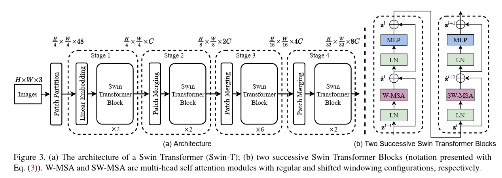
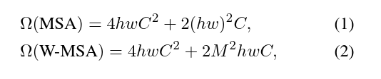
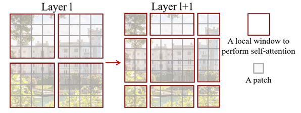
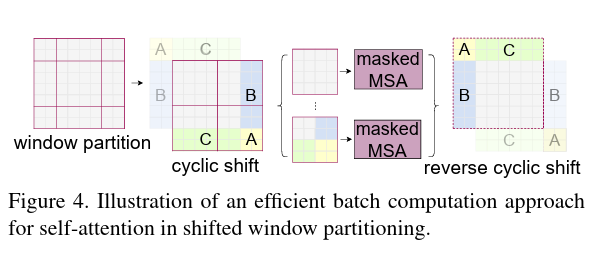
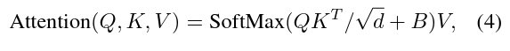

# Swin Transformer论文阅读笔记

### Abstract

​		本篇文章提出了一种新型的视觉Transformer模型，叫做Swin Transformer。现今将Transformer从适用于语言处理转换到适用于视觉处理的挑战源于两个领域的差别。例如，视觉实体的尺度变化大，以及与文本中的词相比，图像中的像素分辨率很高。为了解决这种问题，作者提出了一种多层Transformer，其计算是基于**偏移窗口**的，这种偏移窗口方案通过将自注意力计算限制在不重叠的局部窗口上，提高了效率，同时也允许跨窗口连接。这种分层架构具有模型在各种尺度上的灵活性，并且与图像大小的计算复杂性是线性的。在很多后续任务上都达到了非常不错的效果。

### Introduction

​		首先说了CNN的不断发展让视觉任务的表现越来越好，之后又说了Transformer在NLP任务的巨大成功让人们开始将Transformer引入到视觉任务中。

​		之后就说到这种引入所面临的巨大挑战是两个领域之间的差异，这种差异分为两种：

​		1.与作为语言Transformer中处理的基本元素的单词token不同，视觉元素在尺度上可能会有很大的变化

​		2.另一个差异是图像中像素的分辨率远高于文本段落中的单词。这会让复杂度急速上升，因为计算复杂度与分辨率乘平方关系。

​		为了解决这些问题，就提出了Swin Transformer，它拥有分层的特征图并且计算复杂度与像素呈线性关系。Swin Transformer从小尺寸的块开始，在更深的Transformer层中逐渐合并相邻的块来构建分层表示。有了这些分层特征图，Swin Transformer模型可以方便地利用用于密集预测的高级技术，如特征金字塔网络（FPN）或U-Net 。通过在将图像划分为非重叠窗口（用红色描边）内局部计算自注意力，实现了线性计算复杂性。每个窗口中的块数量是固定的，因此复杂性变为与图像大小成线性关系。

### Method

​		上图就是Swin Transformer的结构。

​		首先先说最开始的结构，Patch Partition首先通过一个卷积层将图片的高和宽变成原来的四分之一，将通道数变成原来的16倍，再通过一个Linear Embedding层调整通道数到C。

​		之后就是Swin Transformer Block，这里边有两个比较需要注意的点，一个是W-MSA，另一个是SW-MSA，这两个Swin Transformer Block是成对出现的，所以我们可以看到Block都是偶数。这成对出现的Block也是能减少计算量的关键。

​		1.W-MSA:W-MSA会把特征图分为多个部分，之后对每个部分进行MSA（注意力机制）计算，比如我有一张49x49的特征图，我现在以7进行分割，就会得到49个7x7的小区域，之后这49个区域自己分别计算MSA。W-MSA与普通MSA的计算量对比如下图：

​		2.SW-MSA：虽然W-MSA可以减少计算量，但是我们忽略了区域之间的信息交互，在普通的MSA里，每一个patch都会和其他所有的patch进行交互，相当于会和全局特征图进行信息交换，但如果我们分割区域的话一个patch只会和自己区域内的其他patch进行交互，无法和其他区域patch进行交互，这样很明显会有信息的损失。而SW-MSA接在W-MSA就是来解决区域之间的信息交互问题的。

​		解决方法如下：如下图所示，会把最上边最左边的2/M(M为窗口大小)行（或列）往右和下去移动（**也就是Shifted，偏移**），最后就会形成下图右边的样子，这样的操作让原本Layer1中处于左上区域的patch可以和处于右上区域的Patch进行通信，除了坐上区域和右上区域，其他的区域之间也都有了一定的联系。

​		

​		但是，有一个新的问题又出现了，新的Layer1+1分成了9块，但这9块大小不一样，不能进行并行计算，会导致计算量和延迟增加，所以要想办法让他可以进行并行计算，也就是将特征图变成几个大小相同的区域，最直观的想法是对每个区域进行填充，填充到最大的4x4，但这样的方法效果并不好。

​		于是作者提出了一种新方法，如下图所示

​		针对于这幅有9个区域的特征图，我们把他的最左边一列放到最右边，之后再把最上边一行放到最后一行。就会形成图中cyclic shift的样子，我们发现，现在的特征图每个区域的大小就一样了，可以进行并行计算了。

​		但是还有一个问题，就是在现在一个区域内存在着原来不同区域的块，比如现在的右下区域又有A，又有B的一部分，又有C的一部分。这不是我们希望的，让不同区域通信这一步骤在上一步移动特征图已经完成了，现在我们不需要再让他们混合到一起了。

​		所以针对这个问题，作者使用了masked MSA，其实就是给不属于该区域的patch加上一个蒙版。比如对于cyclic右下角区域当中的A区域的像素，我们在进行MSA的时候，虽然会计算这个patch对于整个右下角区域的Attention Score（q*k），但是我们会将该patch与不属于A区域的Patch的Attention Score减去100，这样在softmax之后，这些Attention Score就会变为0，也就相当于给不是A区域的区域加上了蒙版。

​		**Relative position bias：**作者发现在MSA计算Attention Score的时候加上一个偏置（绝对位置偏移），也可以增加准确率 ，如下图所示：

